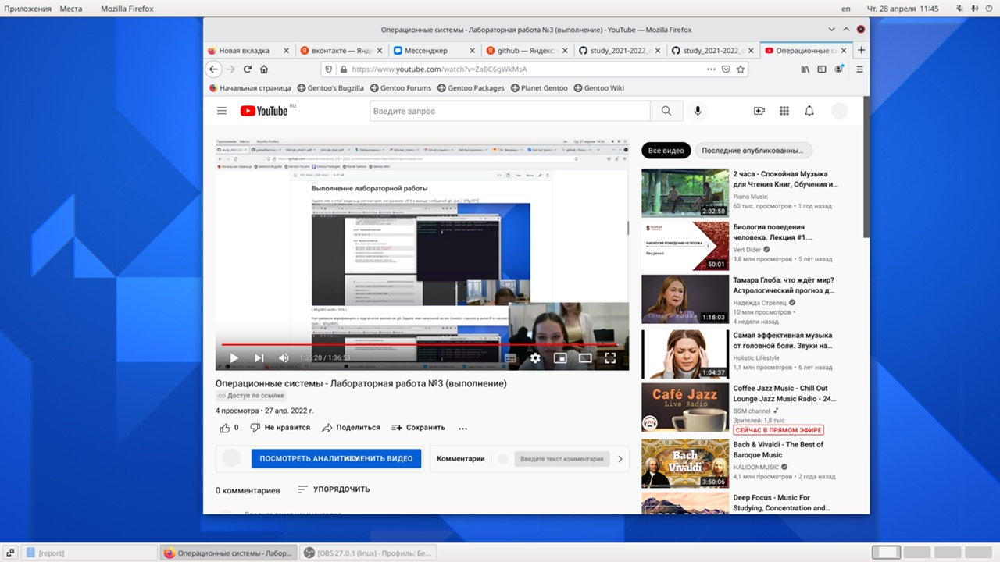

---
## Front matter
title: "Отчёт по лабораторной работе №3"
subtitle: "Операционные системы"
author: "Шатохина Виктория Сергеевна"

## Generic otions
lang: ru-RU
toc-title: "Содержание"

## Bibliography
bibliography: bib/cite.bib
csl: pandoc/csl/gost-r-7-0-5-2008-numeric.csl

## Pdf output format
toc: true # Table of contents
toc-depth: 2
lof: true # List of figures
lot: true # List of tables
fontsize: 12pt
linestretch: 1.5
papersize: a4
documentclass: scrreprt
## I18n polyglossia
polyglossia-lang:
  name: russian
  options:
	- spelling=modern
	- babelshorthands=true
polyglossia-otherlangs:
  name: english
## I18n babel
babel-lang: russian
babel-otherlangs: english
## Fonts
mainfont: PT Serif
romanfont: PT Serif
sansfont: PT Sans
monofont: PT Mono
mainfontoptions: Ligatures=TeX
romanfontoptions: Ligatures=TeX
sansfontoptions: Ligatures=TeX,Scale=MatchLowercase
monofontoptions: Scale=MatchLowercase,Scale=0.9
## Biblatex
biblatex: true
biblio-style: "gost-numeric"
biblatexoptions:
  - parentracker=true
  - backend=biber
  - hyperref=auto
  - language=auto
  - autolang=other*
  - citestyle=gost-numeric
## Pandoc-crossref LaTeX customization
figureTitle: "Рис."
tableTitle: "Таблица"
listingTitle: "Листинг"
lofTitle: "Список иллюстраций"
lotTitle: "Список таблиц"
lolTitle: "Листинги"
## Misc options
indent: true
header-includes:
  - \usepackage{indentfirst}
  - \usepackage{float} # keep figures where there are in the text
  - \floatplacement{figure}{H} # keep figures where there are in the text
---

# Цель работы
Научиться оформлять отчёты с помощью легковесного языка разметки Markdown

# Задание
Сделайте отчёт по предыдущей лабораторной работе в формате Markdown. В качестве отчёта просьба предоставить отчётыв 3 форматах:pdf,docx и md(в архиве,поскольку он должен содержать скриншоты,Makefile и т.д.

# Теоретическое введение
Markdown — облегчённый язык разметки, созданный с целью обозначения форматирования в простом тексте, с максимальным сохранением его читаемости человеком, и пригодный для машинного преобразования в языки для продвинутых публикаций (HTML, Rich Text и других). 

# Выполнение лабораторной работы
Открыли соответствующую папку lab3/report и в терминале выполнили команду make(рис.[-@fig:001])

{ #fig:001 width=70% }

Открылся файл report.md (рис.[-@fig:002])

{ #fig:002 width=70% }

Перенесли скриншоты выполнения лабораторной работы №2 в папку image (рис.[-@fig:003])

{ #fig:003 width=70% }

В открывшемся шаблоне дублируем отчёт лабораторной работы №2 (рис.[-@fig:004])

{ #fig:004 width=70% }

Загрузка на githab файла report.md и скриншотов.(рис.[-@fig:005]) (рис.[-@fig:006])

{ #fig:005 width=70% }

{ #fig:006 width=70% }

Мы получили переделанный отчёт Лабораорной работы №2 в формате Markdown (рис.[-@fig:007])

{ #fig:007 width=70% }

# Выводы
Я научилась оформлять отчёты с помощью легковесного языка разметки Markdown.

::: {#refs}
:::
