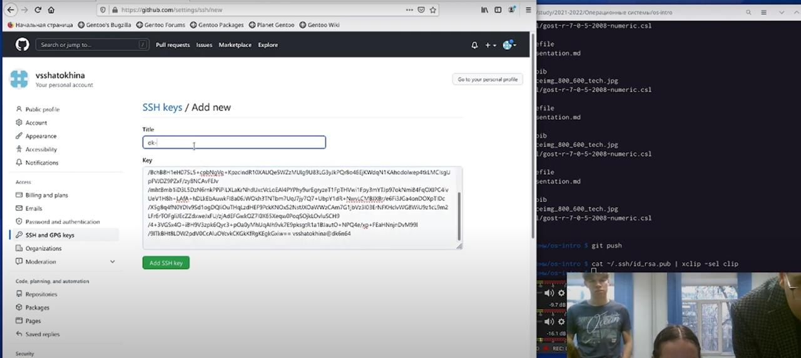
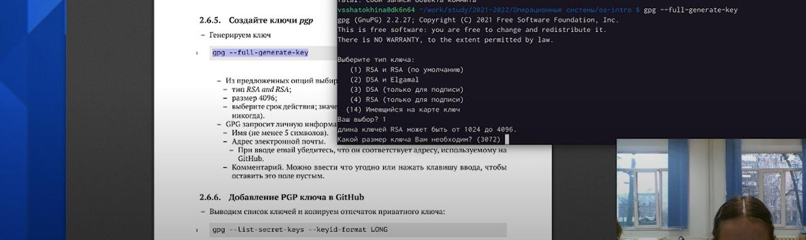

---
## Front matter
title: "Шаблон отчёта по лабораторной работе"
subtitle: "Простейший вариант"
author: "Дмитрий Сергеевич Кулябов"

## Generic otions
lang: ru-RU
toc-title: "Содержание"

## Bibliography
bibliography: bib/cite.bib
csl: pandoc/csl/gost-r-7-0-5-2008-numeric.csl

## Pdf output format
toc: true # Table of contents
toc-depth: 2
lof: true # List of figures
lot: true # List of tables
fontsize: 12pt
linestretch: 1.5
papersize: a4
documentclass: scrreprt
## I18n polyglossia
polyglossia-lang:
  name: russian
  options:
	- spelling=modern
	- babelshorthands=true
polyglossia-otherlangs:
  name: english
## I18n babel
babel-lang: russian
babel-otherlangs: english
## Fonts
mainfont: PT Serif
romanfont: PT Serif
sansfont: PT Sans
monofont: PT Mono
mainfontoptions: Ligatures=TeX
romanfontoptions: Ligatures=TeX
sansfontoptions: Ligatures=TeX,Scale=MatchLowercase
monofontoptions: Scale=MatchLowercase,Scale=0.9
## Biblatex
biblatex: true
biblio-style: "gost-numeric"
biblatexoptions:
  - parentracker=true
  - backend=biber
  - hyperref=auto
  - language=auto
  - autolang=other*
  - citestyle=gost-numeric
## Pandoc-crossref LaTeX customization
figureTitle: "Рис."
tableTitle: "Таблица"
listingTitle: "Листинг"
lofTitle: "Список иллюстраций"
lotTitle: "Список таблиц"
lolTitle: "Листинги"
## Misc options
indent: true
header-includes:
  - \usepackage{indentfirst}
  - \usepackage{float} # keep figures where there are in the text
  - \floatplacement{figure}{H} # keep figures where there are in the text
---

# Выполнение лабораторной работы
Задаём имя и email владельца репозитория, настраиваем utf-8 в выводе
сообщений git (рис.[-@fig:001]).

{ #fig:001 width=70% }

Настраиваем верификацию и подписание коммитов git. Задаём имя начальной ветки (master), параметр autocrlf и параметр safecrlf. (рис.[ -@fig:002])

{ #fig:002 width=70% }

По алгоритму rsa с ключом размером 4096 бит настраиваем ключ.(рис.[-@fig:003]) 

{ #fig:003 width=70% }

{ #fig:004 width=70% }

Далее работаем с сервером репозиториев. Для последующей идентификации
пользователя на сервере репозиториев необходимо сгенерировать пару ключей
(приватный и открытый):
затем, скопировав из локальной консоли ключ в буфер обмена, вставляем ключ
в появившееся на сайте поле.(рис.[ -@fig:005])

{ #fig:005 width=70% }

{ #fig:006 width=70% }
Для загрузки репозитория из локального каталога на сервер выполняем следующие
команды: git remote add origin
 ssh://git@github.com/<username>/<reponame>.git
git push -u origin master

Создаём репозиторий.(рис.[ -@fig:007])

{ #fig:007 width=70%}

{ #fig:008 width=70%}

Создать ключ PGP
Генерируем ключ и выбираем нужные нам опции(рис.[ -@fig:008])

{ #fig:009 width=70%}

{ #fig:010 width=70%}

Далее следует ввести пароль. (рис.[ -@fig:011])

{ #fig:011 width=70%}

Выполняем это задание следующим образом: используя введённый email, указываем Git (применять его при подписи коммитов) (рис.[ -@fig:012])

{ #fig:012 width=70%}

Во время выполнения лабораторной работы я выполнила регистрацию.(рис.[ -@fig:013])

{ #fig:013 width=70%}

Задание было выполнено мною. Каталог создан.(рис.[ -@fig:014])

{ #fig:014 width=70%}

# Выводы
Мною были изучены идеология и применение средств контроля знаний, освоены умения по работе с git.

# Список литературы{.unnumbered}

::: {#refs}
:::
