---
## Front matter
title: "Отчёт по лабораторной работе №4"
subtitle: "Операционные системы"
author: "Шатохина Виктория Сергеевна"

## Generic otions
lang: ru-RU
toc-title: "Содержание"

## Bibliography
bibliography: bib/cite.bib
csl: pandoc/csl/gost-r-7-0-5-2008-numeric.csl

## Pdf output format
toc: true # Table of contents
toc-depth: 2
lof: true # List of figures
lot: true # List of tables
fontsize: 12pt
linestretch: 1.5
papersize: a4
documentclass: scrreprt
## I18n polyglossia
polyglossia-lang:
  name: russian
  options:
	- spelling=modern
	- babelshorthands=true
polyglossia-otherlangs:
  name: english
## I18n babel
babel-lang: russian
babel-otherlangs: english
## Fonts
mainfont: PT Serif
romanfont: PT Serif
sansfont: PT Sans
monofont: PT Mono
mainfontoptions: Ligatures=TeX
romanfontoptions: Ligatures=TeX
sansfontoptions: Ligatures=TeX,Scale=MatchLowercase
monofontoptions: Scale=MatchLowercase,Scale=0.9
## Biblatex
biblatex: true
biblio-style: "gost-numeric"
biblatexoptions:
  - parentracker=true
  - backend=biber
  - hyperref=auto
  - language=auto
  - autolang=other*
  - citestyle=gost-numeric
## Pandoc-crossref LaTeX customization
figureTitle: "Рис."
tableTitle: "Таблица"
listingTitle: "Листинг"
lofTitle: "Список иллюстраций"
lotTitle: "Список таблиц"
lolTitle: "Листинги"
## Misc options
indent: true
header-includes:
  - \usepackage{indentfirst}
  - \usepackage{float} # keep figures where there are in the text
  - \floatplacement{figure}{H} # keep figures where there are in the text
---

# Цель работы
Приобретение практических навыков взаимодействия пользователя с системой посредством командной строки.

# Задание
1. Определите полное имя вашего домашнего каталога. Далее относительно этого ката-
лога будут выполняться последующие упражнения.
2. Выполните следующие действия:
2.1. Перейдите в каталог /tmp.
2.2. Выведите на экран содержимое каталога /tmp. Для этого используйте команду ls
с различными опциями. Поясните разницу в выводимой на экран информации.
2.3. Определите, есть ли в каталоге /var/spool подкаталог с именем cron?Приобретение практических навыков взаимодействия пользователя с системой по-
средством командной строки
2.4. Перейдите в Ваш домашний каталог и выведите на экран его содержимое. Опре-
делите, кто является владельцем файлов и подкаталогов?
3. Выполните следующие действия:
3.1. В домашнем каталоге создайте новый каталог с именем newdir.
3.2. В каталоге ~/newdir создайте новый каталог с именем morefun.
3.3. В домашнем каталоге создайте одной командой три новых каталога с именами
letters, memos, misk. Затем удалите эти каталоги одной командой.
3.4. Попробуйте удалить ранее созданный каталог ~/newdir командой rm. Проверьте,
был ли каталог удалён.
3.5. Удалите каталог ~/newdir/morefun из домашнего каталога. Проверьте, был ли
каталог удалён.
4. С помощью команды man определите, какую опцию команды ls нужно использо-
вать для просмотра содержимое не только указанного каталога, но и подкаталогов,
входящих в него.
5. С помощью команды man определите набор опций команды ls, позволяющий отсорти-
ровать по времени последнего изменения выводимый список содержимого каталога
с развёрнутым описанием файлов.
6. Используйте команду man для просмотра описания следующих команд: cd, pwd, mkdir,
rmdir, rm. Поясните основные опции этих команд.
7. Используя информацию, полученную при помощи команды history, выполните мо-
дификацию и исполнение нескольких команд из буфера команд.

# Выполнение лабораторной работы
Определяем полное имя нашего домашнего каталога (рис. [-@fig:001])

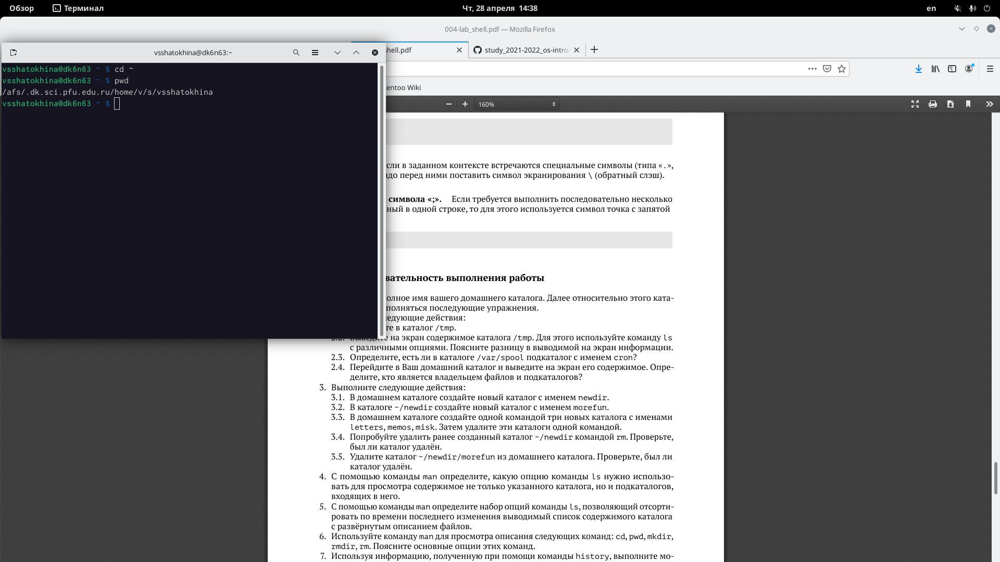{ #fig:001 width=70% }

Переходим в каталог /tmp. А также используем команду ls
с различными опциями.
 
Команда ls -просмотр содержимого каталога (рис. [-@fig:002]) 

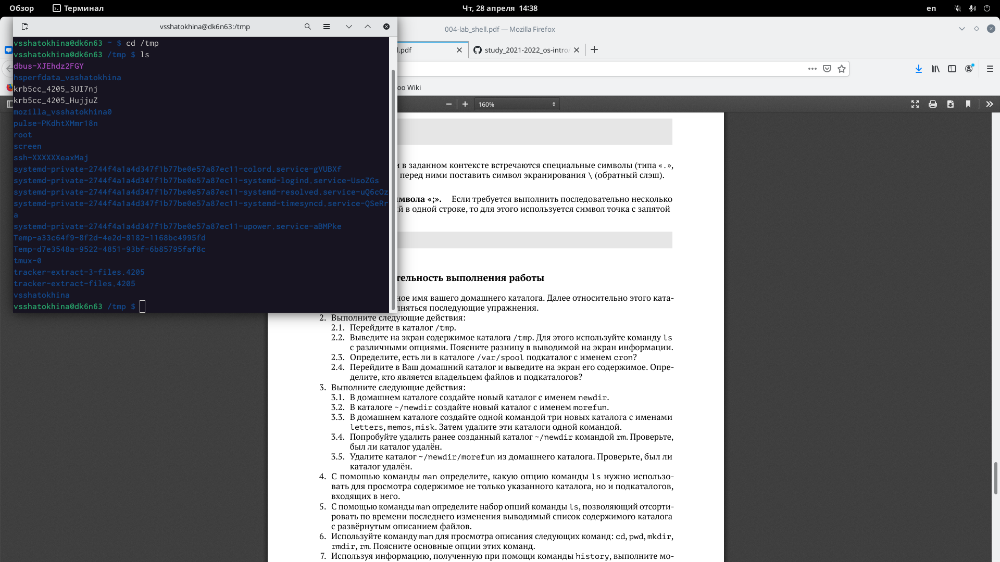{ #fig:002 width=70% }

Команда ls -l -расширенный просмотр каталога (рис. [-@fig:003]) 

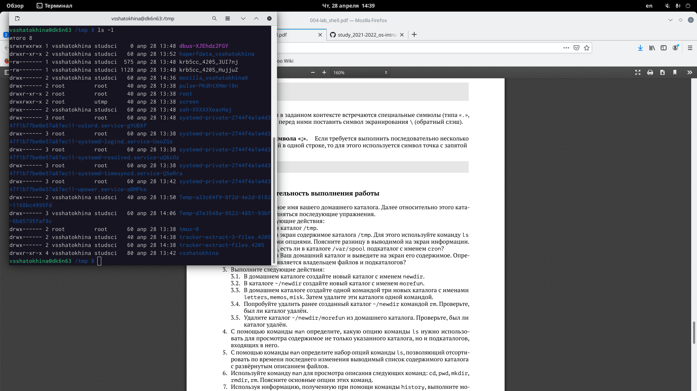{ #fig:003 width=70% }

Команда ls -a -просмотр содержимого каталога вместе со скрытыми файлами (рис. [-@fig:004]) 

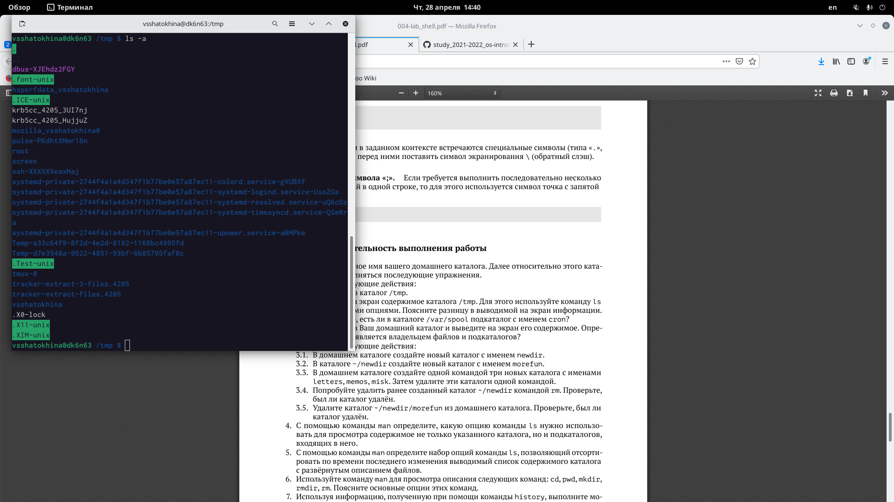{ #fig:004 width=70% }

Переходим в каталог /var/spool и проверяем наличие подкаталога cron . Затем переходим в свой домашний каталог и просматриваем его содержимое с помощью команды ls -l (рис. [-@fig:005])

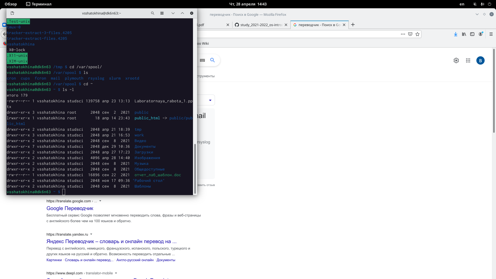{ #fig:005 width=70% }

Далее создаём каталог newdir. Создаём каталог newdir/morefun. (рис. [-@fig:006]) 

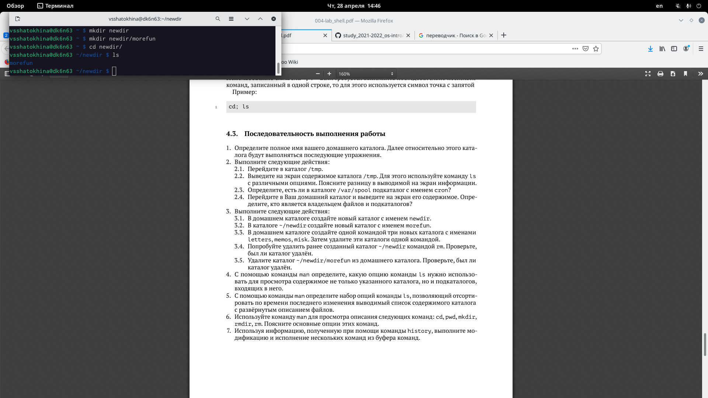{ #fig:006 width=70% }

Создание одной командой трёх новых каталогов с именами
letters, memos, misk и их удаление одной командой.(рис. [-@fig:006])

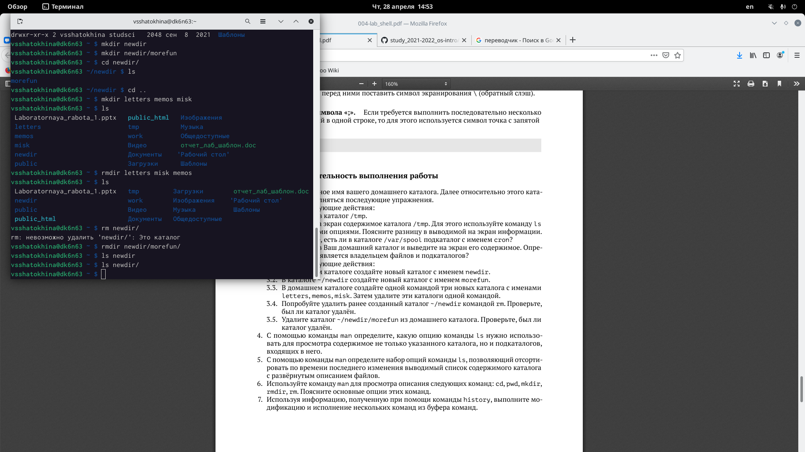{ #fig:007 width=70% }

С помощью команды man опредяем, какую опцию команды ls нужно использовать для просмотра содержимое не только указанного каталога, но и подкаталогов,входящих в него.

Далее с помощью команды man определяем набор опций команды ls, позволяющий отсортировать по времени последнего изменения выводимый список содержимого каталога с развёрнутым описанием файлов. (рис. [-@fig:008]) (рис. [-@fig:009]) 

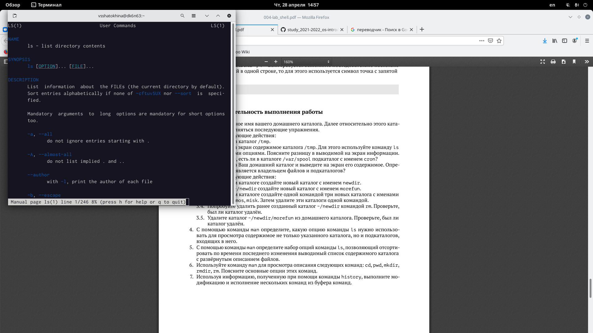{ #fig:008 width=70% }

{ #fig:009 width=70% }

Используем команду man для просмотра описания следующих команд: cd, pwd, mkdir,rmdir, rm. (рис. [-@fig:010])

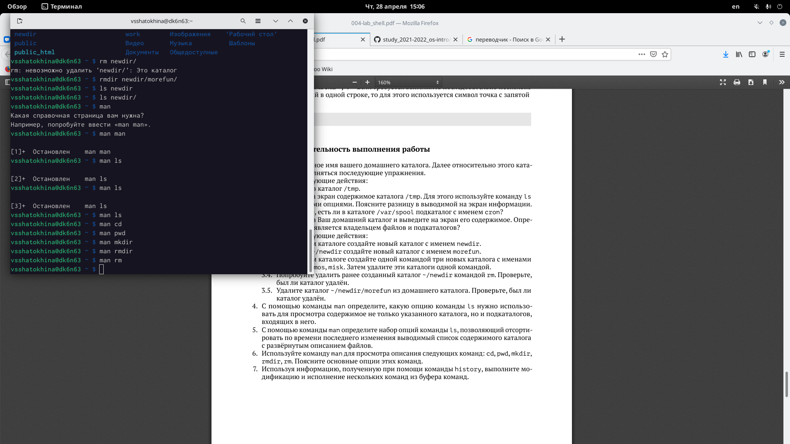{ #fig:010 width=70% }

Используя информацию, полученную при помощи команды history, выполняем модификацию и исполнение нескольких команд из буфера команд. (рис. [-@fig:011])

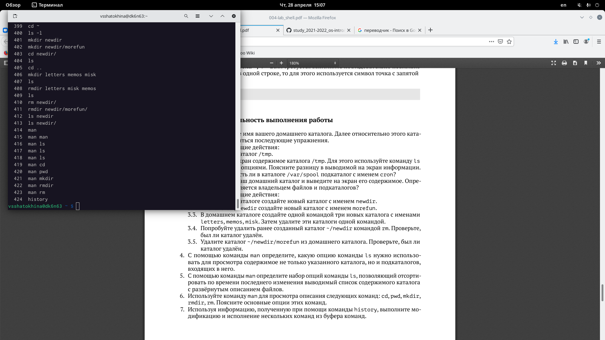{ #fig:011 width=70% }

Вызываем команду 400 и модифицируем команду 409: заменяем -l на -a
(рис. [-@fig:012]) (рис. [-@fig:013])

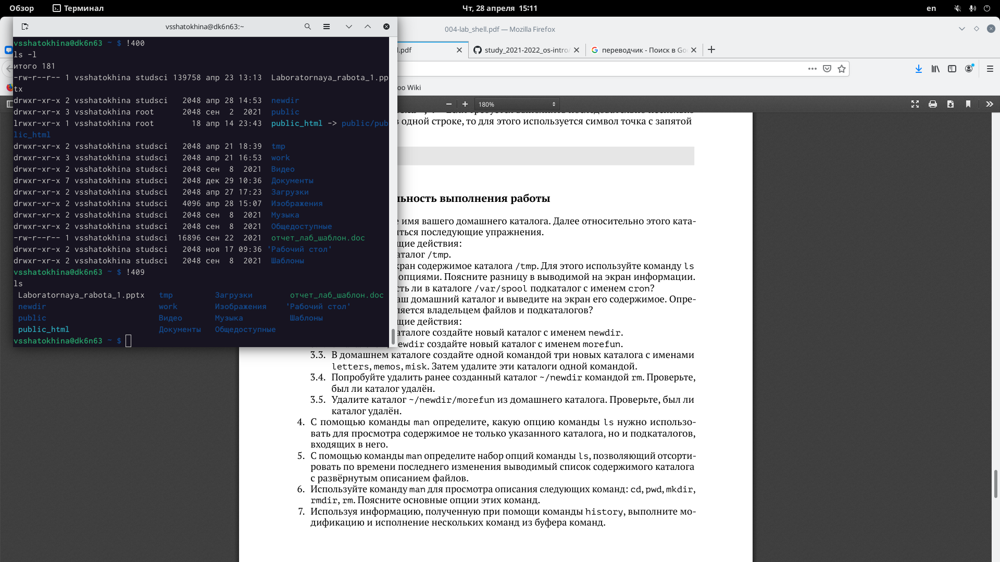{ #fig:012 width=70% }

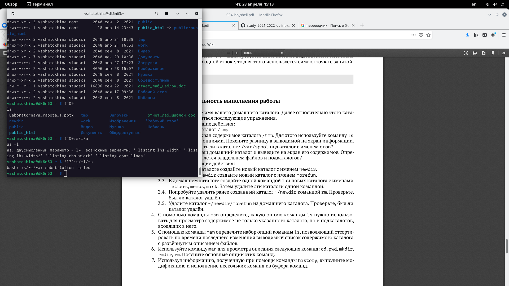{ #fig:013 width=70% }

# Выводы
Мною приобретены практические навыки взаимодействия пользователя с системой посредством командной строки.

::: {#refs}
:::
