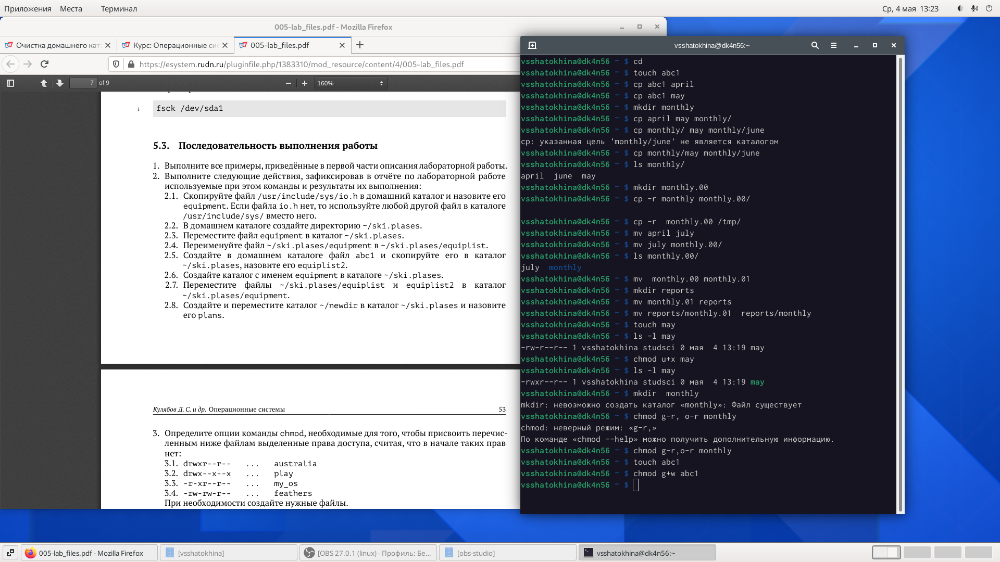
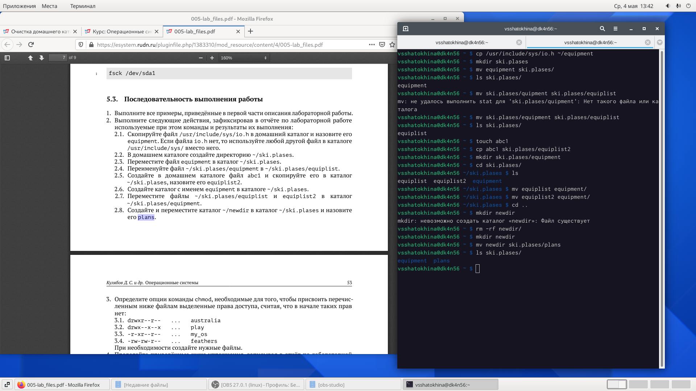
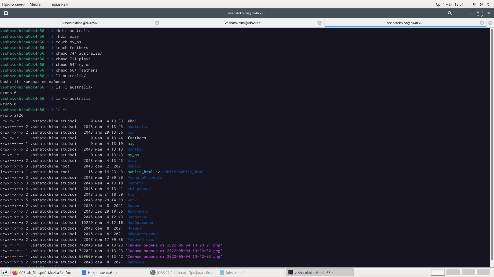
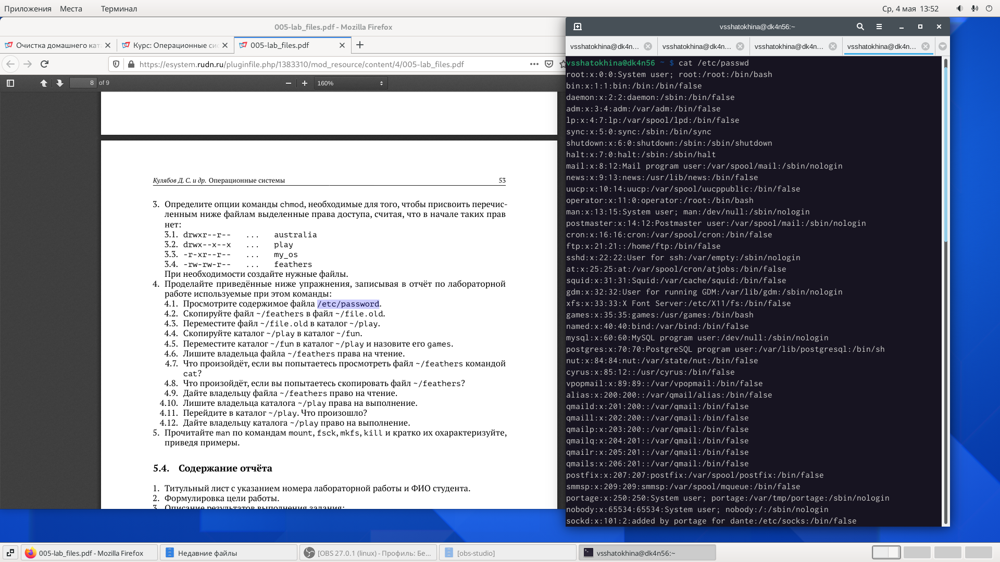
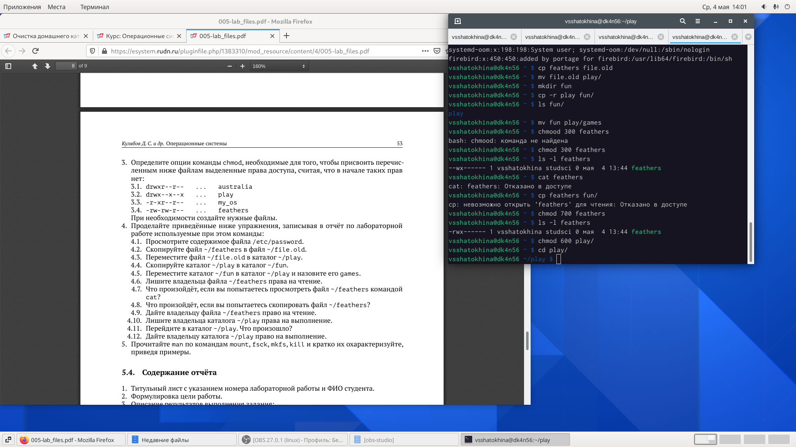
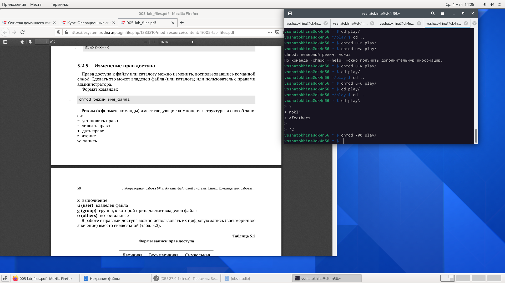
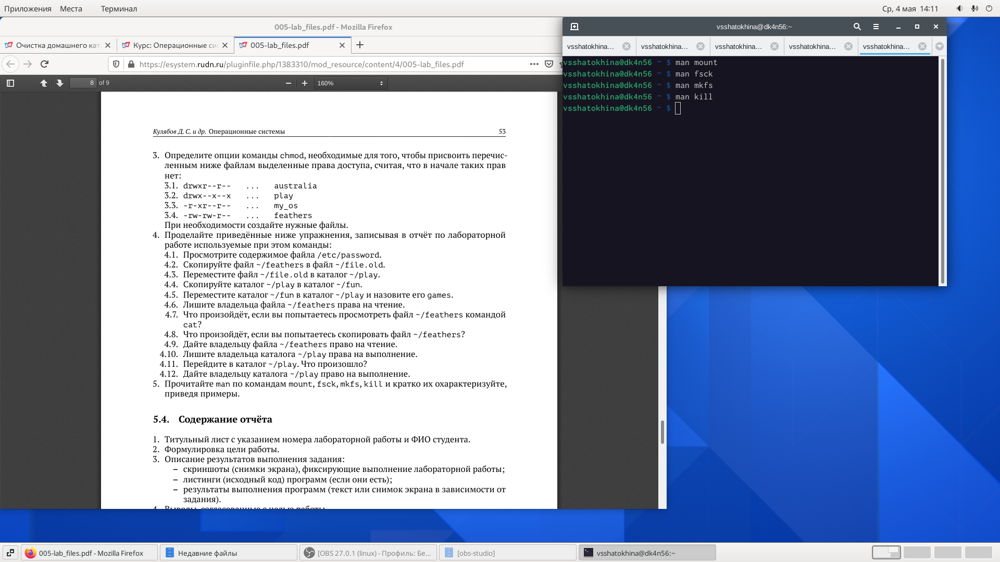

---
# Front matter
lang: ru-RU
title: "Лабораторная работа №5"
subtitle: "Анализ файловой системы Linux. Команды для работы с файлами и каталогами"
author: "Шатохина Виктория Сергеевна"

# Formatting
toc-title: "Содержание"
toc: true # Table of contents
toc_depth: 2
fontsize: 12pt
linestretch: 1.5
papersize: a4paper
documentclass: scrreprt
polyglossia-lang: russian
polyglossia-otherlangs: english
mainfont: PT Serif
romanfont: PT Serif
sansfont: PT Sans
monofont: PT Mono
mainfontoptions: Ligatures=TeX
romanfontoptions: Ligatures=TeX
sansfontoptions: Ligatures=TeX,Scale=MatchLowercase
monofontoptions: Scale=MatchLowercase
indent: true
pdf-engine: lualatex
header-includes:
  - \linepenalty=10 # the penalty added to the badness of each line within a paragraph (no associated penalty node) Increasing the value makes tex try to have fewer lines in the paragraph.
  - \interlinepenalty=0 # value of the penalty (node) added after each line of a paragraph.
  - \hyphenpenalty=50 # the penalty for line breaking at an automatically inserted hyphen
  - \exhyphenpenalty=50 # the penalty for line breaking at an explicit hyphen
  - \binoppenalty=700 # the penalty for breaking a line at a binary operator
  - \relpenalty=500 # the penalty for breaking a line at a relation
  - \clubpenalty=150 # extra penalty for breaking after first line of a paragraph
  - \widowpenalty=150 # extra penalty for breaking before last line of a paragraph
  - \displaywidowpenalty=50 # extra penalty for breaking before last line before a display math
  - \brokenpenalty=100 # extra penalty for page breaking after a hyphenated line
  - \predisplaypenalty=10000 # penalty for breaking before a display
  - \postdisplaypenalty=0 # penalty for breaking after a display
  - \floatingpenalty = 20000 # penalty for splitting an insertion (can only be split footnote in standard LaTeX)
  - \raggedbottom # or \flushbottom
  - \usepackage{float} # keep figures where there are in the text
  - \floatplacement{figure}{H} # keep figures where there are in the text
---

# Цель работы

Ознакомление с файловой системой Linux, её структурой, именами и содержанием каталогов. Приобретение практических навыков по применению команд для работы  с файлами и каталогами, по управлению процессами (и работами), по проверке использования диска и обслуживанию файловой системы.

# Выполнение лабораторной работы

1. Выполнили все примеры, приведённые в первой части описания лабораторной работы. (рис. [-@fig:001])

{ #fig:001 width=90% }

2. Выполнили следующие действия: 
  - Скопировали файл /usr/include/sys/io.h в домашний каталог и назовите его equipment. Если файла io.h нет, то используйте любой другой файл в каталоге /usr/include/sys/ вместо него.
- В домашнем каталоге создали директорию ~/ski.plases.
- Переместили файл equipment в каталог ~/ski.plases.
- Переименовали файл ~/ski.plases/equipment в ~/ski.plases/equiplist.
- Создали в домашнем каталоге файл abc1 и скопировали его в каталог
~/ski.plases, назовите его equiplist2.
- Создали каталог с именем equipment в каталоге ~/ski.plases.
- Переместили файлы ~/ski.plases/equiplist и equiplist2 в каталог ~/ski.plases/equipment.
- Создали и переместили каталог ~/newdir в каталог ~/ski.plases и назвали его plans

(рис. [-@fig:002])

{ #fig:002 width=90% } 

3. Определили опции команды chmod, необходимые для того, чтобы присвоить перечисленным ниже файлам выделенные права доступа, считая, что в начале таких прав нет:
- drwxr--r-- ... australia
- drwx--x--x ... play
- -r-xr--r-- ... my_os
- -rw-rw-r-- ... feathers  

(рис. [-@fig:003])

{ #fig:003 width=90% }

4. Просмотрели содержимое файла /etc/password (рис. [-@fig:004]) (рис. [-@fig:005]) 

{ #fig:004 width=90% }

{ #fig:005 width=90% }

5. Выполнение пункта 4

- Скопировали файл ~/feathers в файл ~/file.old.
- Переместили файл ~/file.old в каталог ~/play.
- Скопировали каталог ~/play в каталог ~/fun.
- Переместили каталог ~/fun в каталог ~/play и назовите его games.
- Лишили владельца файла ~/feathers права на чтение.
- Что произойдёт, если вы попытаетесь просмотреть файл ~/feathers командой
cat? (Нам было отказано в доступе)
- Что произойдёт, если вы попытаетесь скопировать файл ~/feathers? (Нам было отказано в доступе)
- Дали владельцу файла ~/feathers право на чтение.
- Лишили владельца каталога ~/play права на выполнение.
- Перешли в каталог ~/play. Что произошло? (Отказано в доступе)
- Дали владельцу каталога ~/play право на выполнение.

(рис. [-@fig:006 ]) (рис. [-@fig:007])

{ #fig:006 width=90% }

{ #fig:007 width=90% }

6. Прочитайте man по командам mount, fsck, mkfs, kill (рис. [-@fig:008])

{ #fig:008 width=70% } 

Mount - нужна для просмотра смонтированных файловых систем, а также для монтирования любых локальных или удаленных файловых систем.  
Fsck - проверяет и исправляет в диалоговом режиме несогласованные условия в файловых системах 
Mkfs создает файловые системы 
Kill – завершает некорекктно работующее приложение. 

# Вывод

Ознакомились с файловой системой Linux, её структурой, именами и содержанием каталогов. Приобрели практические навыки по применению команд для работы с файлами и каталогами.

# Контрольные вопросы

1.	Дайте характеристику каждой файловой системе, существующей на жёстком диске компьютера, на котором вы выполняли лабораторную работу.
Ответ: С помощью команды df –T, мы можем познакомиться с файловыми системами · Файловая система devtmpfs была разработана для решения проблемы с доступностью устройств во время загрузки. Ядро создает файлы устройств по мере надобности, а также уведомляет менеджер udevd о том, что доступно новое устройство. После получения такого сигнала менеджер udevd не создает файлы устройств, а выполняет инициализацию устройства и отправляет уведомление процессу. Кроме того, он создает несколько символических ссылок в каталоге /dev для дальнейшей идентификации устройств.

- Tmpfs — временное файловое хранилище в Unix . Предназначена для монтирования файловой системы, но размещается в ОЗУ вместо физического диска. Подобная конструкция является RAM диском.Все данные в Tmpfs являются временными, в том смысле, что ни одного файла не будет создано на жёстком диске. После перезагрузки все данные, содержащиеся в Tmpfs, будут утеряны. · Fourth extended file system , сокр. ext4, или ext4fs — журналируемая ФС, используемая в ОС с ядром Linux. Основана на ФС ext3, ранее использовавшейся по умолчанию во многих дистрибутивах GNU/Linux. · Распределенная сетевая файловая система AFS (Andrew File System) внедрена с целью создания единого файлового пространства пользователей при работе на различных фермах или рабочих станциях ОИЯИ, где домашний каталог пользователя определен как каталог в -AFS. Использование системы AFS позволяет пользователям осуществлять прямой доступ к файловому пространству других организаций, где эта система используется и где пользователь имеет регистрацию в AFS.

2.	Приведите общую структуру файловой системы и дайте характеристику каждой директории первого уровня этой структуры.
Ответ: Все каталоги можно разделить на две группы: для статической (редко меняющейся) информации – /bin, /usr и динамической (часто меняющейся) информации – /var, /tmp. Исходя из этого администраторы могут разместить каждый из этих каталогов на собственном носителе, обладающем соответствующими характеристиками. · Корневой каталог. Корневой каталог / является основой любой ФС UNIX. Все остальные каталоги и файлы располагаются в рамках структуры (дерева), порождённой корневым каталогом, независимо от их физического местонахождения. · /bin. В этом каталоге находятся часто употребляемые команды и утилиты системы общего пользования. Сюда входят все базовые команды, доступные даже если была примонтирована только корневая файловая система. Примерами таких команд являются:Ls,cp и т.д. · /boot. Директория содержит всё необходимое для процесса загрузки операционной системы: программу-загрузчик, образ ядра операционной системы и т.п.. · /dev. Каталог содержит специальные файлы устройств, являющиеся интерфейсом доступа к периферийным устройствам. Наличие такого каталога не означает, что специальные файлы устройств нельзя создавать в другом месте, просто достаточно удобно иметь один каталог для всех файлов такого типа. · /etc. В этом каталоге находятся системные конфигурационные файлы. В качестве примеров можно привести файлы /etc/fstab, содержащий список монтируемых файловых систем, и /etc/ resolv.conf, который задаёт правила составления локальных DNS-запросов. Среди наиболее важных файлов – скрипты инифиализации и деинициализации системы. В системах, наследующих особенности UNIX System V, для них отведены каталоги с /etc/rc0.d по /etc/rc6.d и общий для всех файл описания – /etc/inittab. · /home (необязательно). Директория содержит домашние директории пользователей. Её существование в корневом каталоге не обязательно и её содержимое зависит от особенностей конкретной UNIX-подобной операционной системы. · /lib. Каталог для статических и динамических библиотек, необходимых для запуска программ, находящихся-в директориях/bin,/sbin. · /mnt. Стандартный каталог для временного монтирования файловых систем – например, гибких и флэш-дисков, компакт-дисков и т. п. · /root (необязательно). Директория содержит домашюю директорию суперпользователя. Её существование в корневом каталоге не обязательно. · /sbin. В этом каталоге находятся команды и утилиты для системного администратора. Примерами таких команд являются: route, halt, init и др. Для аналогичных целей применяются директории /usr/sbin и /usr/local/sbin. · /usr. Эта директория повторяет структуру корневой директории – содержит каталоги /usr/ bin, /usr/lib, /usr/sbin, служащие для аналогичных целей. Каталог /usr/include содержит заголовочные файлы языка C для всевозможные библиотек, расположенных в системе. · /usr/local является следующим уровнем повторения корневого каталога и служит для хранения программ, установленных администратором в дополнение к стандартной поставке операционной системы. · /usr/share хранит неизменяющиеся данные для установленных программ. Особый интерес представляет каталог /usr/share/doc, в который добавляется документация ко всем установленным программам. · /var, /tmp. Используются для хранения временных данных процессов – системных и пользовательских соответственно.

3.	Какая операция должна быть выполнена,чтобы содержимое некоторой файловой системы было доступно операционной системе?
Ответ: С помощью команды cd мы переходим в каталог, в котором находится файл. С помощью less мы открываем этот файл.

4.	Назовите основные причины нарушения целостности файловой системы. Какустранить повреждения файловой системы?
Ответ: Основные причины нарушения целостности файловой системы: · Из-за прерывания операций ввода-вывода выполняемых непосредственно с диском; · Сбоя питания; · Краха ОС; · Нарушения работы дискового КЭШа; Устранение поврежденных файлов:В большинстве случаев, проверка файловой системы способна обнаружить и выполнить ремонт такой ошибки автоматически, и после завершения процесс начальной загрузки продолжится как обычно. Если проблема файловой системы более серьезна, проверка файловой системы не может решить проблему автоматически. В этом случае процесс надо будет запустить вручную.

5.	Как создаётся файловая система?
Ответ: Обычно при установке Linux создание файловых систем - компетенция инсталлятора, который осуществляет его с некоторыми опциями по умолчанию. Изменить характеристики, определенные для файловой системы при ее создании, невозможно без повторного выполнения этого процесса . Файловая система Ext2fs может быть создана любой из следующих команд - /sbin/mke2fs, / sbin/mkfs, /sbin/mkfs.ext2 с указанием файла устройства в качестве аргумента. Для создания XFS -mkfs.xfs (из пакета xfsprogs). Для создания файловой системы ext3fs -mke2fs с опцией j. Файловая система ReiserFS - /sbin/mkreiserfs из пакета reiserfsprogs.

6.	Дайте характеристику командам, которые позволяют просмотреть текстовые файлы.
Ответ: · Для просмотра небольших файлов -cat. (cat имя-файла) · Для просмотра больших файлов-less . (less имя-файла) · Для просмотра начала файла- head. По умолчанию она выводит первые 10 строк файла. (head [-n] имя-файла), n — количество выводимых строк. · Команда tail . выводит несколько (по умолчанию 10) последних строк файла. (tail [-n] имя-файла),n — количество выводимых строк.

7.	Приведите основные возможности команды cp в Linux
Ответ: При помощи команды cp осуществляется копирование файлов и каталогов (cp[-опции] исходныйфайл целевойфайл) Возможности команды ср: · копирование файла в текущем каталоге · копирование нескольких файлов в каталог · копирование файлов в произвольном каталоге · опция i в команде cp поможет избежать уничтожения информации в случае, если на место целевого файла вы поставите имя уже существующего файла(т.е. система попросит подтвердить, что вы хотите перезаписать этот файл) · Команда cp с опцией r (recursive) позволяет копировать каталоги вместе с входящими в них файлами и каталогами.

8.	Назовите и дайте характеристику командам перемещения и переименованияфайлов и каталогов.
Ответ: Команды mv и mvdir предназначены для перемещения и переименования файлов и каталогов. (mv [-опции] старыйфайл новыйфайл) Для получения предупреждения перед переписыванием файла стоит использовать опцию i.

9.	Что такое права доступа? Как они могут быть изменены?
Ответ: Права доступа - совокупность правил, регламентирующих порядок и условия доступа субъекта к объектам информационной системы (информации, её носителям, процессам и другим ресурсам) установленных правовыми документами или собственником, владельцем информации. Для изменения прав доступа к файлу или каталогу используется команда-chmod.( chmod режим имя_файла) Права доступа к файлу может поменять только владелец и администратор. Режим (в формате команды) имеет следующую структуру и способ записи: · = установить право · - лишить права · + дать право · r чтение · w запись · x выполнение · u (user) владелец файла · g (group) группа, к которой принадлежит владелец файла · (others) все остальные.
