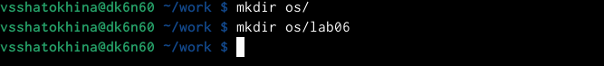

---
## Front matter
title: "Лабораторная работа №8"
subtitle: "Операционные системы"
author: "Шатохина Виктория Сергеевна"

## Generic otions
lang: ru-RU
toc-title: "Содержание"

## Bibliography
bibliography: bib/cite.bib
csl: pandoc/csl/gost-r-7-0-5-2008-numeric.csl

## Pdf output format
toc: true # Table of contents
toc-depth: 2
lof: true # List of figures
lot: true # List of tables
fontsize: 12pt
linestretch: 1.5
papersize: a4
documentclass: scrreprt
## I18n polyglossia
polyglossia-lang:
  name: russian
  options:
	- spelling=modern
	- babelshorthands=true
polyglossia-otherlangs:
  name: english
## I18n babel
babel-lang: russian
babel-otherlangs: english
## Fonts
mainfont: PT Serif
romanfont: PT Serif
sansfont: PT Sans
monofont: PT Mono
mainfontoptions: Ligatures=TeX
romanfontoptions: Ligatures=TeX
sansfontoptions: Ligatures=TeX,Scale=MatchLowercase
monofontoptions: Scale=MatchLowercase,Scale=0.9
## Biblatex
biblatex: true
biblio-style: "gost-numeric"
biblatexoptions:
  - parentracker=true
  - backend=biber
  - hyperref=auto
  - language=auto
  - autolang=other*
  - citestyle=gost-numeric
## Pandoc-crossref LaTeX customization
figureTitle: "Рис."
tableTitle: "Таблица"
listingTitle: "Листинг"
lofTitle: "Список иллюстраций"
lotTitle: "Список таблиц"
lolTitle: "Листинги"
## Misc options
indent: true
header-includes:
  - \usepackage{indentfirst}
  - \usepackage{float} # keep figures where there are in the text
  - \floatplacement{figure}{H} # keep figures where there are in the text
---

# Цель работы

Познакомиться с операционной системой Linux.Получить практические навыки работы с редактором vi,установленным по умолчанию практически во всех дистрибутивах.

# Выполнение лабораторной работы

1. Создали каталог с именем ~/work/os/lab06. (рис. [-@fig:001]) https://github.com/vsshatokhina/study_2021-2022_os-intro/blob/master/labs/lab08/report/image/1.png

{ #fig:001 width=90% }

2. Перешли во вновь созданный каталог, вызвали vi и создайли файл hello.sh (рис. [-@fig:002]) https://github.com/vsshatokhina/study_2021-2022_os-intro/blob/master/labs/lab08/report/image/2.png

{ #fig:002 width=90% } 

3. Нажали клавишу "i" и ввели текст (рис. [-@fig:003]) https://github.com/vsshatokhina/study_2021-2022_os-intro/blob/master/labs/lab08/report/image/3.png

{ #fig:003 width=90% }

4. Делаем файл испольняемым (рис. [-@fig:004]) https://github.com/vsshatokhina/study_2021-2022_os-intro/blob/master/labs/lab08/report/image/4.png

{ #fig:004 width=90% }

5. Вызвали vi на редактирование файла (рис. [-@fig:005]) https://github.com/vsshatokhina/study_2021-2022_os-intro/blob/master/labs/lab08/report/image/5.png

{ #fig:005 width=90% }

6. Установили курсор в конец слова HELL второй строки. Перешли в режим вставки и заменили на HELLO (рис. [-@fig:006]) https://github.com/vsshatokhina/study_2021-2022_os-intro/blob/master/labs/lab08/report/image/6.png

{ #fig:006 width=90% }

7. Установили курсор на четвертую строку и стёрли слово LOCAL. Перешли в режим вставки и набрали следующий текст:local (рис. [-@fig:007]) https://github.com/vsshatokhina/study_2021-2022_os-intro/blob/master/labs/lab08/report/image/7.png

{ #fig:007 width=90% }

8. Установили курсор на последней строке файла. Вставили после неё строку "echo $HELLO" (рис. [-@fig:008]) https://github.com/vsshatokhina/study_2021-2022_os-intro/blob/master/labs/lab08/report/image/8.png

{ #fig:008 width=90% }

9. Удалили последнюю строку. Ввели команду отмены изменений "u" для отмены последней команды. Последняя строка восстановилась.

# Выводы

Познакомились с операционной системой Linux. Получили практические навыки работы с редактором vi,установленным по умолчанию практически во всех дистрибутивах.

# Ответы на контрольные вопросы 

   1. Командный режим позволяет управлять курсором и вводить команды редактирования. Режим вставки допускает производить ввод текста. При этом текст не будет восприниматься, как команды редактирования. Режим последней строки позволяет производить запись файла на диск и выходить из редактора Vi. Кроме того, используя этот режим, можно вводить дополнительные команды редактирования.
   2. Если необходимо просто выйти Vi (без сохранения выполненных изменений), то необходимо в последней строке набрать символ q (или q!).
   3. 0 (ноль) - перейти в начало строки; $ - перейти в конец строки; G - перейти в конец файла; nG - перейти на строку номер n.
   4. Редактор vi предполагает, что слово - это строка символов, которая может включать в себя буквы, цифры и символы подчеркивания.
   5. 0 (ноль) - перейти в начало строки; $ - перейти в конец строки; 6. Добавление / вставка текста а- добавить текст после курсора; А- добавить текст в конец строки; i- вставить текст перед курсором; ni- вставить текст n раз; I- вставить текст в началостроки. Вставка строки o-вставить строку под курсором; О- вставить строку над курсором. Удаление текста x- удалить один символ в буфер; dw- удалить одно слово в буфер; d$- удалить в буфер текст от курсора до конца строки; d0-(ноль) - удалить в буфер текст от начала строки до позиции курсора; dd- удалить в буфер одну строку; 10dd- удалить в буфер 10 строк. Отмена и повтор произведенных изменений u- отменить последнее изменение; - повторить последнее изменение. Копирование текста в буфер Y- скопировать строку в буфер; nY- скопировать n строк в буфер; yw- скопировать слово в буфер; Вставка текста из буфера p- вставить текст из буфера после курсора; P- вставить текст из буфера перед курсором. Замена текста cw - заменить слово; n cw - заменить n слов; c$- заменить текст от курсора до конца строки; r- заменить слово; R- заменить текст. Поиск текста / <текст> - произвести поиск вперед по тексту указанной строки символов <текст>; ? <текст> - произвести поиск назад по тексту указанной строки символов <текст>.
   6. c$ - заменить текст от курсора до конца строки.
   7. u- отменить последнее изменение
   8. Kопирование и перемещение текста :n,m d-уничтожить строки с n по m пример: : 3,8d : i,j m k- переместить строки с i по j , начиная со строки k пример : : 4,9m12 : i,j t k- копировать строки с i по j на строку k пример: : 2,5 t 13 : i,j w <имя_файла>- записать строки с i по j в файл с именем <имя_файла> пример: : 5,9 <имя _файла>. Запись в файл и выход из редактора :w- записать измененныйтекст в файл на диске, не выходя из Vi; :w - записать измененный текст в новый файл с именем ; :w! <имя_файла>- записать измененный текст в файл с именем<имя_файла> ; - :wq- записать изменения в файл и выйти из Vi; :q- выйти из редактора Vi; :q!- выйти из редактора без записи; :e!- вернуться в командный режим, отменив все изменения,произведенные со времени последней записи
   9. $ - перемещает курсор в конец строки.
   10. Опции редактора Vi позволяют настроить рабочую среду. Для задания опций используется команда set (в режиме последней строки): : set all - вывести полный список опций; : set nu - вывести номера строк; : set list - вывести невидимые символы; : set ic - не учитывать при поиске, является ли символ прописным или строчным.
   11. Нажатие клавиши ESC всегда переводит Vi в командный режим (это удобно, когда вы точно не помните в каком режиме находитесь). Если вы нажмете клавишу ESC, находясь в командном режиме, машина напомнит вам об этом, подав звуковой сигнал.
   12. Командный –>вставки– >последняя строка (командная строка).

::: {#refs}
:::
