---
## Front matter
title: "Отчёт по лаюораторной работе №9"
subtitle: "Операционные системы"
author: "Шатохина Виктория Сергеевна"

## Generic otions
lang: ru-RU
toc-title: "Содержание"

## Bibliography
bibliography: bib/cite.bib
csl: pandoc/csl/gost-r-7-0-5-2008-numeric.csl

## Pdf output format
toc: true # Table of contents
toc-depth: 2
lof: true # List of figures
lot: true # List of tables
fontsize: 12pt
linestretch: 1.5
papersize: a4
documentclass: scrreprt
## I18n polyglossia
polyglossia-lang:
  name: russian
  options:
	- spelling=modern
	- babelshorthands=true
polyglossia-otherlangs:
  name: english
## I18n babel
babel-lang: russian
babel-otherlangs: english
## Fonts
mainfont: PT Serif
romanfont: PT Serif
sansfont: PT Sans
monofont: PT Mono
mainfontoptions: Ligatures=TeX
romanfontoptions: Ligatures=TeX
sansfontoptions: Ligatures=TeX,Scale=MatchLowercase
monofontoptions: Scale=MatchLowercase,Scale=0.9
## Biblatex
biblatex: true
biblio-style: "gost-numeric"
biblatexoptions:
  - parentracker=true
  - backend=biber
  - hyperref=auto
  - language=auto
  - autolang=other*
  - citestyle=gost-numeric
## Pandoc-crossref LaTeX customization
figureTitle: "Рис."
tableTitle: "Таблица"
listingTitle: "Листинг"
lofTitle: "Список иллюстраций"
lotTitle: "Список таблиц"
lolTitle: "Листинги"
## Misc options
indent: true
header-includes:
  - \usepackage{indentfirst}
  - \usepackage{float} # keep figures where there are in the text
  - \floatplacement{figure}{H} # keep figures where there are in the text
---

# Цель работы

Познакомиться с операционной системой Linux. Получить практические навыки рабо-
ты с редактором Emacs.

# Теоретическое введение

Emacs представляет собой мощный экранный редактор текста, написанный на языке высокого уровня Elisp.

**Определение 1.** Буфер — объект, представляющий какой-либо текст.

Буфер может содержать что угодно, например, результаты компиляции программы или встроенные подсказки. Практически всё взаимодействие с пользователем, в том числе интерактивное, происходит посредством буферов.

**Определение 2.** Фрейм соответствует окну в обычном понимании этого слова. Каждый фрейм содержит область вывода и одно или несколько окон Emacs.

**Определение 3.** Окно — прямоугольная область фрейма, отображающая один из буферов.

Каждое окно имеет свою строку состояния, в которой выводится следующая информация: название буфера, его основной режим, изменялся ли текст буфера и как далеко вниз по буферу расположен курсор. Каждый буфер находится только в одном из возможных
основных режимов. Существующие основные режимы включают режим Fundamental (наименее специализированный), режим Text, режим Lisp, режим С, режим Texinfo и другие. Под второстепенными режимами понимается список режимов, которые включены в данный момент в буфере выбранного окна.

**Определение 4.** Область вывода — одна или несколько строк внизу фрейма, в которой Emacs выводит различные сообщения, а также запрашивает подтверждения и дополнительную информацию от пользователя.

**Определение 5.** Минибуфер используется для ввода дополнительной информации и всегда отображается в области вывода.

**Определение 6.** Точка вставки — место вставки (удаления) данных в буфере.

# Выполнение лабораторной работы

**1.** Открыла emacs.(рис. [-@fig:001])

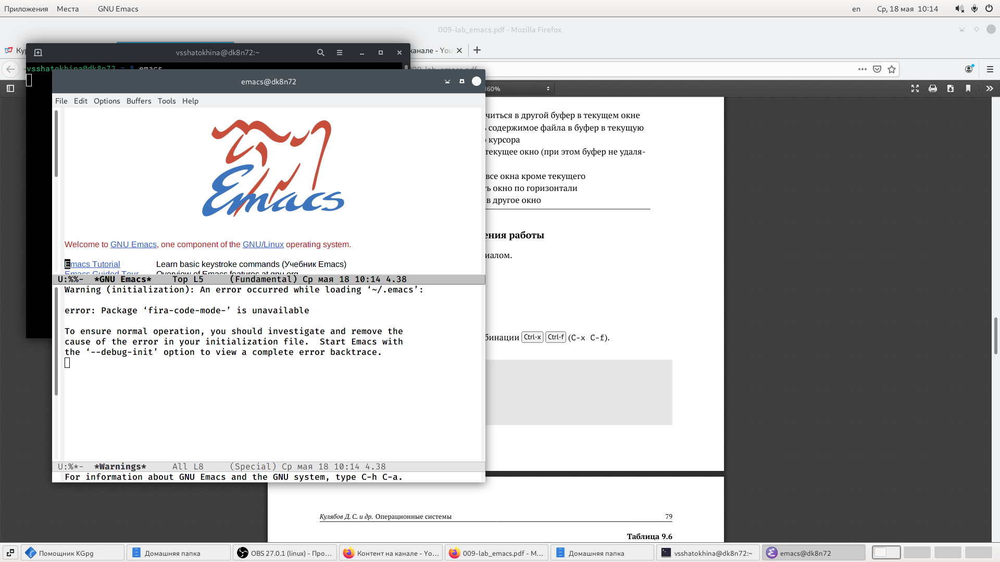{ #fig:001 width=70% }

**2.** Создала файл lab07.sh с помощью комбинации Ctrl-x Ctrl-f (C-x C-f).(рис. [-@fig:002])

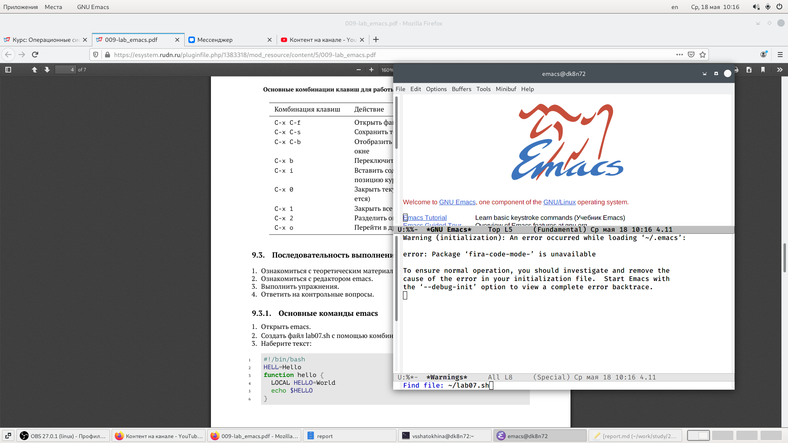{ #fig:002 width=70% }

**3.** Набрала текст.(рис. [-@fig:003])

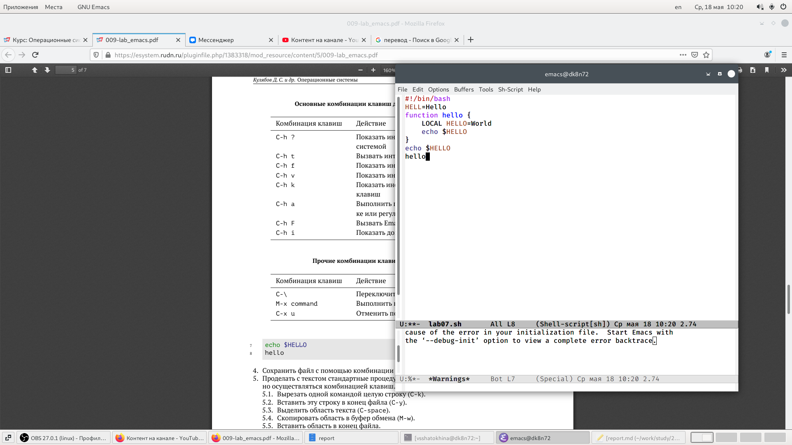{ #fig:003 width=70% }

**4.** Сохранила файл с помощью комбинации Ctrl-x Ctrl-s (C-x C-s).

**5.** Проделала с текстом стандартные процедуры редактирования:

5.1. Вырезала одной командой целую строку (С-k).(рис. [-@fig:004])

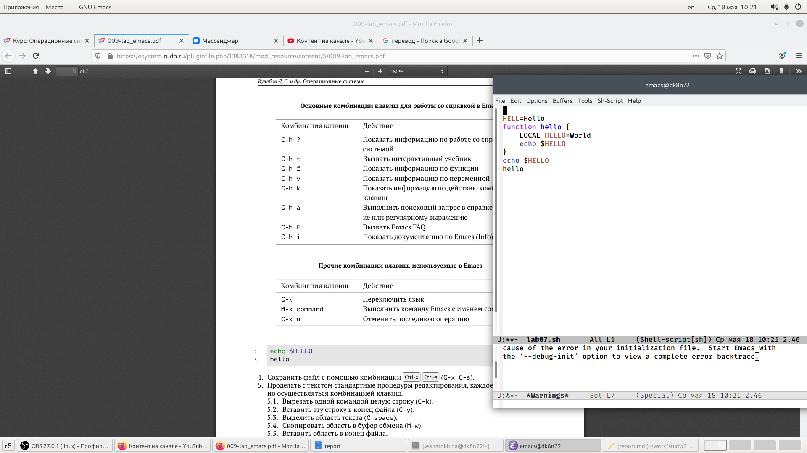{ #fig:004 width=70% }

5.2. Вставила эту строку в конец файла (C-y).(рис. [-@fig:005])

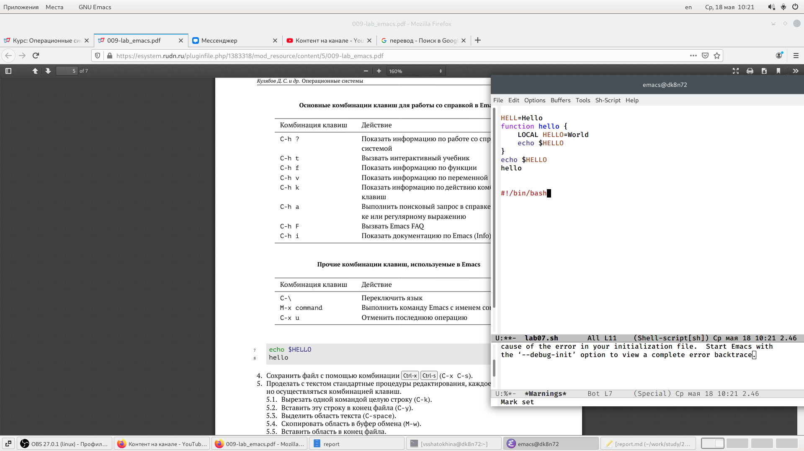{ #fig:005 width=70% }

5.3. Выделила область текста (C-space).(рис. [-@fig:006])

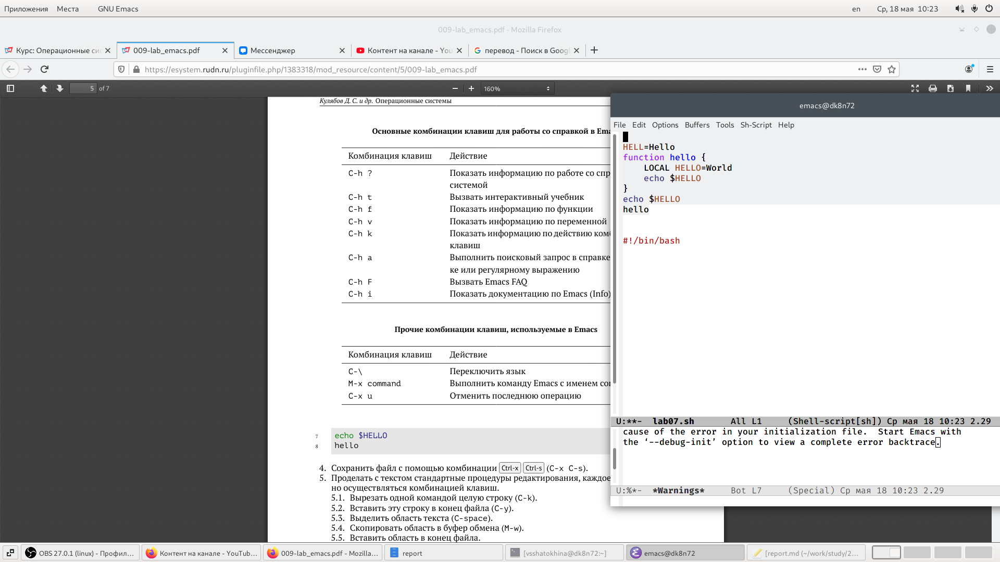{ #fig:006 width=70% }

5.4. Скопировала область в буфер обмена (M-w).

5.5. Вставила область в конец файла.(рис. [-@fig:007])

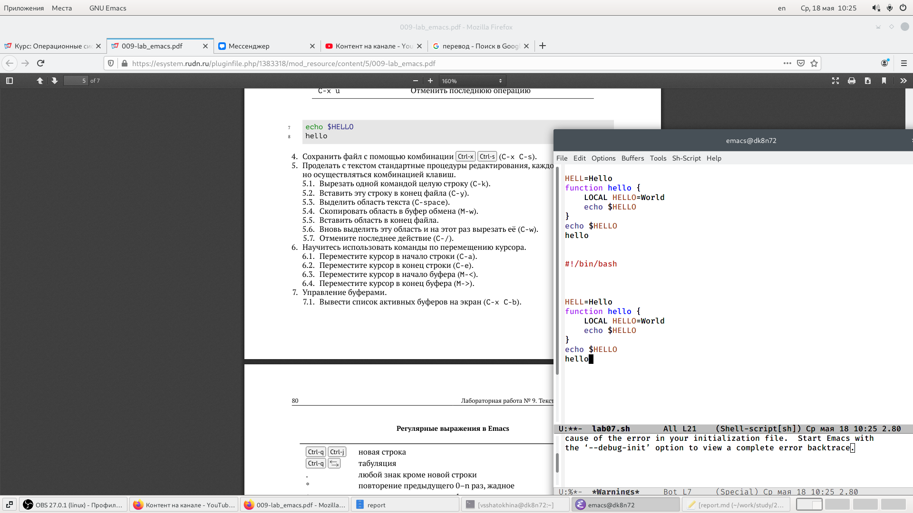{ #fig:007 width=70% }

5.6. Вновь выделила эту область и на этот раз вырезала её (C-w).

5.7. Отменила последнее действие (C-/).

**6.** Научилась использовать команды по перемещению курсора:

6.1. Переместила курсор в начало строки (C-a).(рис. [-@fig:008])

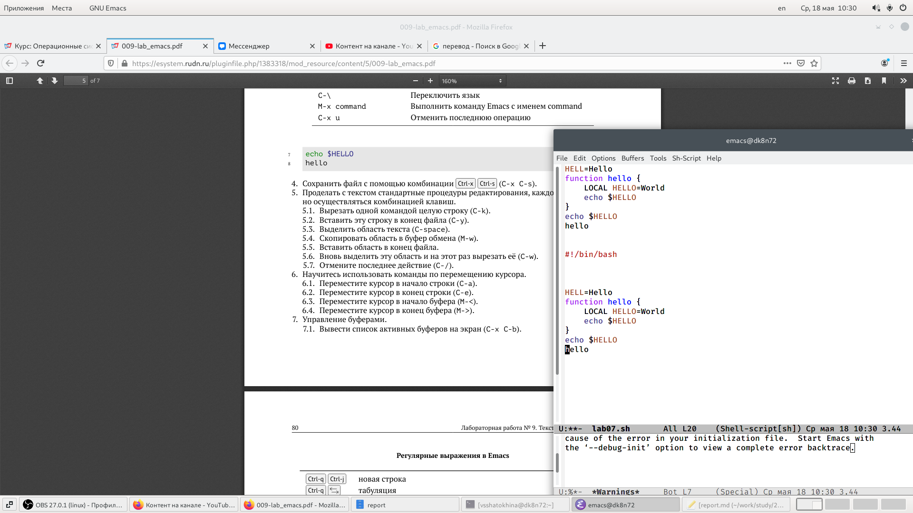{ #fig:008 width=70% }

6.2. Переместила курсор в конец строки (C-e).(рис. [-@fig:009])

{ #fig:009 width=70% }

6.3. Переместила курсор в начало буфера (M-<).

6.4. Переместила курсор в конец буфера (M->).

**7.** Научилась управлять буфером:

7.1. Вывела список активных буферов на экран (C-x C-b).(рис. [-@fig:010])

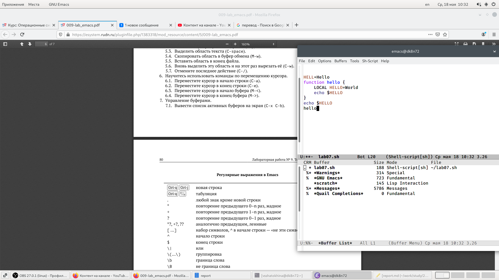{ #fig:010 width=70% }

7.2. Переместилась во вновь открытое окно (C-x) со списком открытых буферов и переключилась на другой буфер.

7.3. Закрыла это окно (C-x 0).

7.4. Теперь вновь переключилась между буферами, но уже без вывода их списка на экран (C-x b).

**8.** Управление окнами:

8.1. Поделила фрейм на 4 части: разделила фрейм на два окна по вертикали (C-x 3), а затем каждое из этих окон на две части по горизонтали (C-x 2).(рис. [-@fig:011])

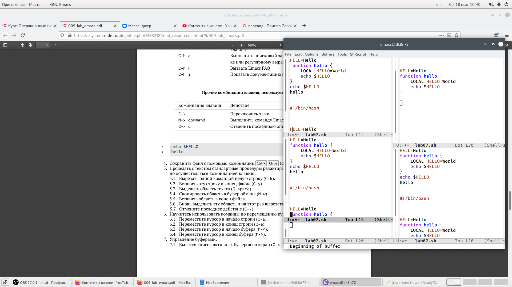{ #fig:011 width=70% }

8.2. В каждом из четырёх созданных окон открыла новый буфер (файл) и ввела несколько строк текста.(рис. [-@fig:012])

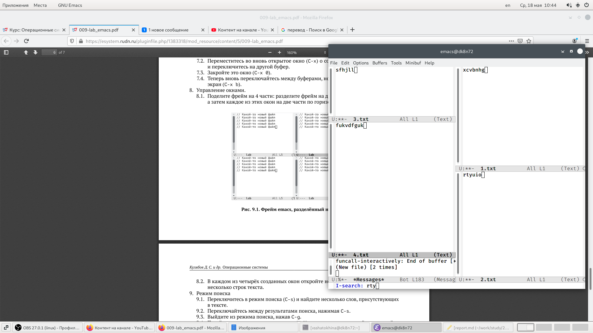{ #fig:012 width=70% }

**9.** Режим поиска:

9.1. Переключилась в режим поиска (C-s) и нашла несколько слов, присутствующих в тексте.(рис. [-@fig:013])

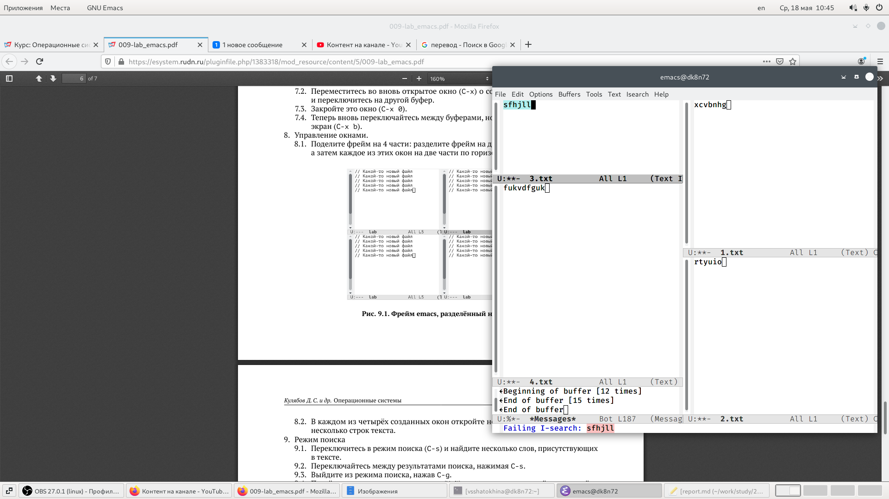{ #fig:013 width=70% }

9.2. Переключилась между результатами поиска, нажимая C-s.

9.3. Вышла из режима поиска, нажав C-g.

9.4. Перешла в режим поиска и замены (M-%), ввела текст, который следует найти и заменила, нажала Enter , затем ввела текст для замены. После того как были подсвечены результаты поиска, нажала ! для подтверждения замены.

9.5. Испробовала другой режим поиска, нажав M-s o.

# Выводы

Познакомилась с операционной системой Linux. Получила практические навыки работы с редактором Emacs.

# Контрольные вопросы

1. Emacs представляет собой мощный экранный редактор текста, написанный на языке высокого уровня Elisp.

2. Для работы с emacs используется система меню и комбинаций клавиш. Многие рутинные операции в Emacs удобнее производить с помощью клавиатуры, а не графического меню. Наиболее часто в командах Emacs используются сочетания c клавишами Ctrl и Meta. Так как на клавиатуре для IBM PC совместимых ПК клавиши Meta нет, то вместо неё можно использовать Alt или Esc . Для доступа к системе меню используйте клавишу F10 .

3. **Буфер** — объект, представляющий какой-либо текст. **Окно** — прямоугольная область фрейма, отображающая один из буферов.

4. Можно открыть больше 10 буферов в одном окне.

5. Создаются по умолчанию при запуске emacs: % GNU Emacs 844 Fundamental scratch 191 Lisp Interaction %* Messages 5257 Messages % Quail Completions 0 Fundamental

6. Клавиши: Ctrl,C,Shift,,] и ,Ctrl,C Ctrl,Shift,,]

7. Разделите фрейм на два окна по вертикали C-x 3, окно на две части по горизонтали C-x 2

8. В файле Emacs хранятся настройки редактора emacs.

9. Kнопка backspace( стереть букву ) = функции C-k и ее можно переназначить.

10. Emacs оказался намного удобнее. В нём больше функций, в нём интересно редактировать информацию.

# Список литературы{.unnumbered}

::: {#refs}
:::
