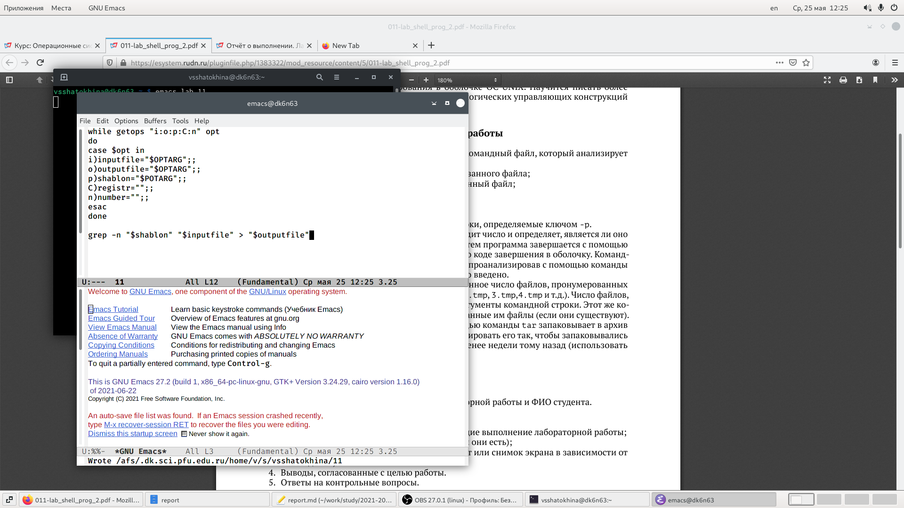
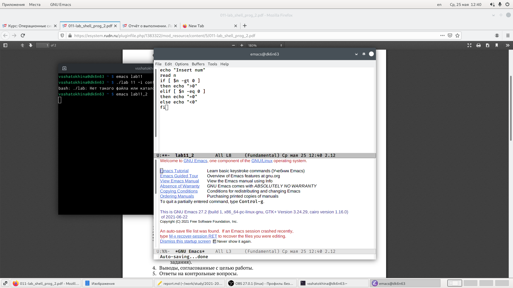
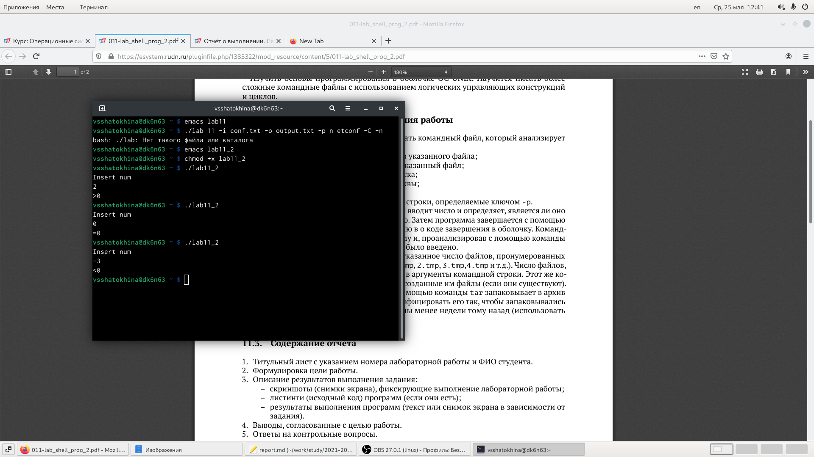
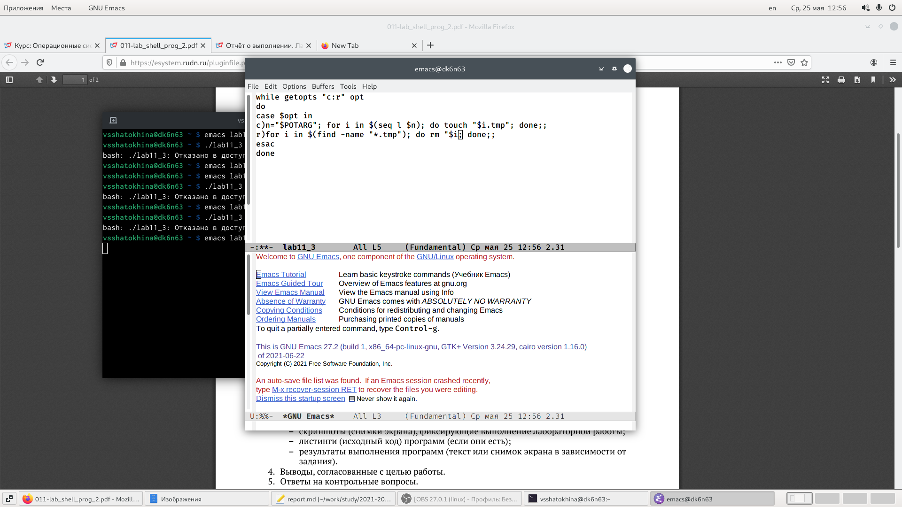
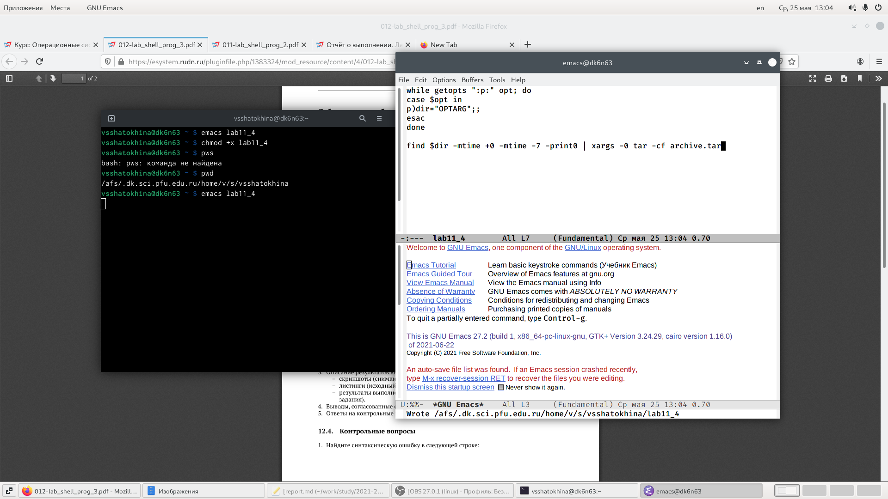

---
## Front matter
title: "Отчёт по лабораторной работе №11"
subtitle: "Операционые системы"
author: "Шатохина Виктория Сергеевна"

## Generic otions
lang: ru-RU
toc-title: "Содержание"

## Bibliography
bibliography: bib/cite.bib
csl: pandoc/csl/gost-r-7-0-5-2008-numeric.csl

## Pdf output format
toc: true # Table of contents
toc-depth: 2
lof: true # List of figures
lot: true # List of tables
fontsize: 12pt
linestretch: 1.5
papersize: a4
documentclass: scrreprt
## I18n polyglossia
polyglossia-lang:
  name: russian
  options:
	- spelling=modern
	- babelshorthands=true
polyglossia-otherlangs:
  name: english
## I18n babel
babel-lang: russian
babel-otherlangs: english
## Fonts
mainfont: PT Serif
romanfont: PT Serif
sansfont: PT Sans
monofont: PT Mono
mainfontoptions: Ligatures=TeX
romanfontoptions: Ligatures=TeX
sansfontoptions: Ligatures=TeX,Scale=MatchLowercase
monofontoptions: Scale=MatchLowercase,Scale=0.9
## Biblatex
biblatex: true
biblio-style: "gost-numeric"
biblatexoptions:
  - parentracker=true
  - backend=biber
  - hyperref=auto
  - language=auto
  - autolang=other*
  - citestyle=gost-numeric
## Pandoc-crossref LaTeX customization
figureTitle: "Рис."
tableTitle: "Таблица"
listingTitle: "Листинг"
lofTitle: "Список иллюстраций"
lotTitle: "Список таблиц"
lolTitle: "Листинги"
## Misc options
indent: true
header-includes:
  - \usepackage{indentfirst}
  - \usepackage{float} # keep figures where there are in the text
  - \floatplacement{figure}{H} # keep figures where there are in the text
---

# Цель работы

Изучить основы программирования в оболочке ОС UNIX. Научится писать более
сложные командные файлы с использованием логических управляющих конструкций
и циклов.

# Выполнение лабораторной работы

1. Скрипт 1 (рис. [-@fig:001])  https://github.com/vsshatokhina/study_2021-2022_os-intro/blob/master/labs/lab11/report/image/1.png

{ #fig:001 width=90% }

2. Скрипт 2 (рис. [-@fig:002])  https://github.com/vsshatokhina/study_2021-2022_os-intro/blob/master/labs/lab11/report/image/2.png

{ #fig:002 width=90% }

Запуск (рис. [-@fig:003])  https://github.com/vsshatokhina/study_2021-2022_os-intro/blob/master/labs/lab11/report/image/3.png

{ #fig:003 width=90% }

3. Скрипт 3  (рис. [-@fig:004]) https://github.com/vsshatokhina/study_2021-2022_os-intro/blob/master/labs/lab11/report/image/4.png

{ #fig:004 width=90% }

4. Скрипт 4 (рис. [-@fig:005]) https://github.com/vsshatokhina/study_2021-2022_os-intro/blob/master/labs/lab11/report/image/5.png

{ #fig:005 width=90% }

# Вывод

Изучили основы программирования в оболочке ОС UNIX. Научились писать более
сложные командные файлы с использованием логических управляющих конструкций
и циклов.

# Контрольные вопросы

1.	Весьма необходимой при программировании является команда getopts, которая осуществляет синтаксический анализ командной строки, выделяя флаги, и используется для объявления переменных. Синтаксис команды следующий: getopts option-string variable [arg ... ] Флаги – это опции командной строки, обычно помеченные знаком минус; Например, -F является флагом для команды ls -F. Иногда эти флаги имеют аргументы, связанные с ними. 
Программы интерпретируют эти флаги, соответствующим образом изменяя свое поведение.
Строка опций option-string — это список возможных букв и чисел соответствующего флага. Если ожидается, что некоторый флаг будет сопровождаться некоторым аргументом, то за этой буквой должно следовать двоеточие. Соответствующей переменной присваивается буква данной опции. Если команда getopts может распознать аргумент, она возвращает истину. Принято включать getopts в цикл while и анализировать введенные данные с помощью оператора case. Предположим, необходимо распознать командную строку следующего формата: testprog -ifile_in.txt -ofile_out.doc -L -t -r Вот как выглядит использование оператора getopts в этом случае: while getopts o:i:Ltr optletter do case $optletter in o) oflag=1; oval=$OPTARG;; i) iflag=1; ival=$OPTARG;; L) Lflag=1;; t) tflag=1;; r) rflag=1;; *) echo Illegal option $optletter esac done Функция getopts включает две специальные переменные среды – OPTARG и OPTIND. Если ожидается дополнительное значение, то OPTARG устанавливается в значение этого аргумента (будет равна file_in.txt для опции i и file_out.doc для опции o) . OPTIND является числовым индексом на упомянутый аргумент. Функция getopts также понимает переменные типа массив, следовательно, можно использовать ее в функции не только для синтаксического анализа аргументов функций, но и для анализа введенных пользователем данных.
2.	При перечислении имен файлов текущего каталога можно использовать следующие символы:
· * — соответствует произвольной, в том числе и пустой строке;
· ? — соответствует любому одному символу;
· [c1-c1] — соответствует любому символу, лексикографически на ходящемуся между символами c1 и с2.
· echo * — выведет имена всех файлов текущего каталога, что представляет собой простейший аналог команды ls;
· ls *.c — выведет все файлы с последними двумя символами, равными .c.
· echo prog.? — выдаст все файлы, состоящие из пяти или шести символов, первыми пятью символами которых являются prog. .
· [a-z]* — соответствует произвольному имени файла в текущем каталоге, начинающемуся с любой строчной буквы латинского алфавита.
3.	Часто бывает необходимо обеспечить проведение каких-либо действий циклически и управление дальнейшими действиями в зависимости от результатов проверки некоторого условия. Для решения подобных задач язык программирования bash предоставляет Вам возможность использовать такие управляющие конструкции, как for, case, if и while. С точки зрения командного процессора эти управляющие конструкции являются обычными командами и могут использоваться как при создании командных файлов, так и при работе в интерактивном режиме. Команды, реализующие подобные конструкции, по сути дела являются операторами языка программирования bash. Поэтому при описании языка программирования bash термин оператор будет использоваться наравне с термином команда.
4.	Два несложных способа позволяют вам прерывать циклы в оболочке bash. Команда break завершает выполнение цикла, а команда continue завершает данную итерацию блока операторов. Команда break полезна для завершения цикла while в ситуациях, когда условие перестает быть правильным. Пример бесконечного цикла while, с прерыванием в момент, когда файл перестает существовать:
while true do
if [! -f $file] then break
fi
sleep 10 done
5.	Команды ОС UNIX возвращают код завершения, значение которого может быть использовано для принятия решения о дальнейших действиях. Команда test, например, создана специально для использования в командных файлах. Единственная функция этой команды заключается в выработке кода завершения.
6.	Введенная строка означает условие существования файла man$s/$i.$s
7.	Если речь идет о 2-х параллельных действиях, то это while. когда мы показываем, что сначала делается 1-е действие. потом оно заканчивается при наступлении 2-го действия, применяем until.

# Список литературы{.unnumbered}

::: {#refs}
:::
