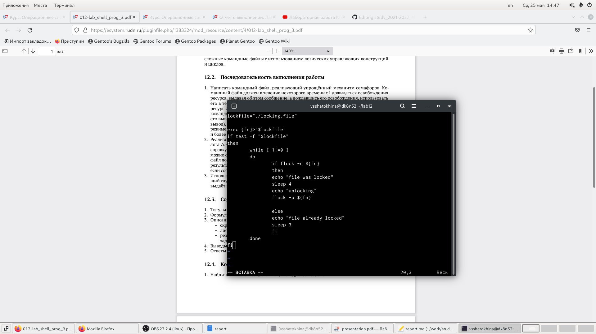
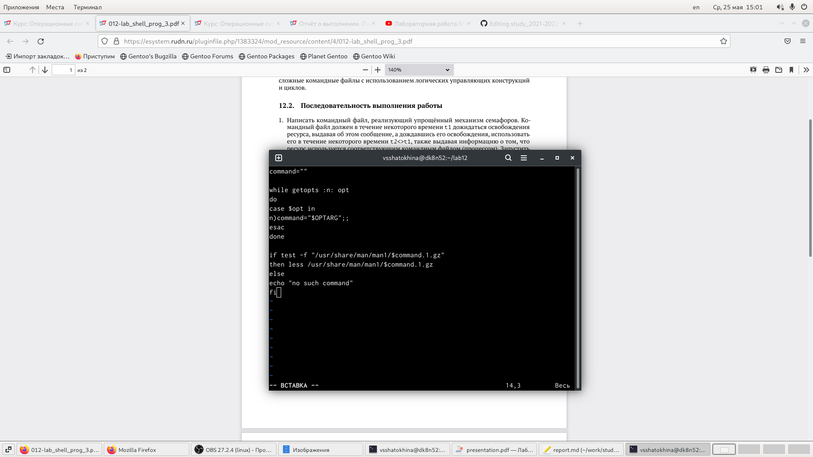

---
# Front matter
lang: ru-RU
title: "Лабораторная работа 12"
subtitle: "Программирование в командном процессоре ОС UNIX. Расширенное программирование"
author: "Шатохина Виктория Сергеевна"

# Formatting
toc-title: "Содержание"
toc: true # Table of contents
toc_depth: 2
fontsize: 12pt
linestretch: 1.5
papersize: a4paper
documentclass: scrreprt
polyglossia-lang: russian
polyglossia-otherlangs: english
mainfont: PT Serif
romanfont: PT Serif
sansfont: PT Sans
monofont: PT Mono
mainfontoptions: Ligatures=TeX
romanfontoptions: Ligatures=TeX
sansfontoptions: Ligatures=TeX,Scale=MatchLowercase
monofontoptions: Scale=MatchLowercase
indent: true
pdf-engine: lualatex
header-includes:
  - \linepenalty=10 # the penalty added to the badness of each line within a paragraph (no associated penalty node) Increasing the value makes tex try to have fewer lines in the paragraph.
  - \interlinepenalty=0 # value of the penalty (node) added after each line of a paragraph.
  - \hyphenpenalty=50 # the penalty for line breaking at an automatically inserted hyphen
  - \exhyphenpenalty=50 # the penalty for line breaking at an explicit hyphen
  - \binoppenalty=700 # the penalty for breaking a line at a binary operator
  - \relpenalty=500 # the penalty for breaking a line at a relation
  - \clubpenalty=150 # extra penalty for breaking after first line of a paragraph
  - \widowpenalty=150 # extra penalty for breaking before last line of a paragraph
  - \displaywidowpenalty=50 # extra penalty for breaking before last line before a display math
  - \brokenpenalty=100 # extra penalty for page breaking after a hyphenated line
  - \predisplaypenalty=10000 # penalty for breaking before a display
  - \postdisplaypenalty=0 # penalty for breaking after a display
  - \floatingpenalty = 20000 # penalty for splitting an insertion (can only be split footnote in standard LaTeX)
  - \raggedbottom # or \flushbottom
  - \usepackage{float} # keep figures where there are in the text
  - \floatplacement{figure}{H} # keep figures where there are in the text
---

# Цель работы

Изучить основы программирования в оболочке ОС UNIX. Научиться писать более сложные командные файлы с использованием логических управляющих конструкций и циклов.

# Выполнение лабораторной работы

1. Скрипт 1 (рис. [-@fig:001]) https://github.com/vsshatokhina/study_2021-2022_os-intro/blob/master/labs/lab12/report/image/1.png

{ #fig:001 width=90% }

2. Скрипт 2 (рис. [-@fig:002]) https://github.com/vsshatokhina/study_2021-2022_os-intro/blob/master/labs/lab12/report/image/2.png

{ #fig:002 width=90% }

3. Скрипт 3 (рис. [-@fig:003]) https://github.com/vsshatokhina/study_2021-2022_os-intro/blob/master/labs/lab12/report/image/3.png

{ #fig:003 width=90% }

# Вывод

Научились писать более сложные командные файлы с использованием логических управляющих конструкций и циклов.

# Контрольные вопросы

1: **Найдите синтаксическую ошибку в следующей строке: while [\$1 != "exit"]**

\$1.
Так же между скобками должны быть пробелы. В противном случае скобки и рядом стоящие символы будут восприниматься как одно целое

2:	**Как объединить (конкатенация) несколько строк в одну?**

cat file.txt | xargs | sed -e 's/\\. /.\\n/g'

3:	**Найдите информацию об утилите seq. Какими иными способами можно реализовать её функционал при программировании на bash?**

seq - выдает последовательность чисел. Реализовать ее функционал можно командой for n in \{1..5\}
do <КОМАНДА>
done

4:	**Какой результат даст вычисление выражения \$((10/3))?**

3

5:	**Укажите кратко основные отличия командной оболочки zsh от bash.**

Zsh очень сильно упрощает работу. Но существуют различия. Например, в zsh после for обязательно вставлять пробел, нумерация массивов в zsh начинается с 1 (что не особо удобно на самом деле).
Если вы собираетесь писать скрипт, который легко будет запускать множество разработчиков, то я рекомендуется Bash. Если скрипты вам не нужны - Zsh (более простая работа с файлами, например)

6:	**Проверьте, верен ли синтаксис данной конструкции for ((a=1; a <= LIMIT; a++))**

Верен

7:	**Сравните язык bash с какими-либо языками программирования. Какие преимущества у bash по сравнению с ними? Какие недостатки?**

Bash позволяет очень легко работать с файловой системой без лишних конструкций (в отличи от обычного языка программирования). Но относительно обычных языков программирования bash очень сжат. Тот же Си имеет гораздо более широкие возможности для разработчика.
