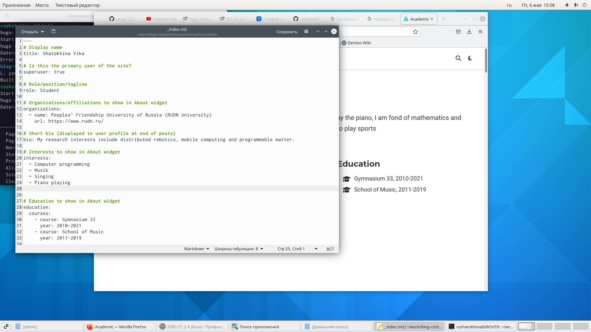
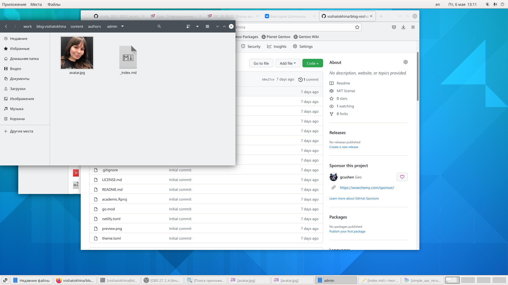
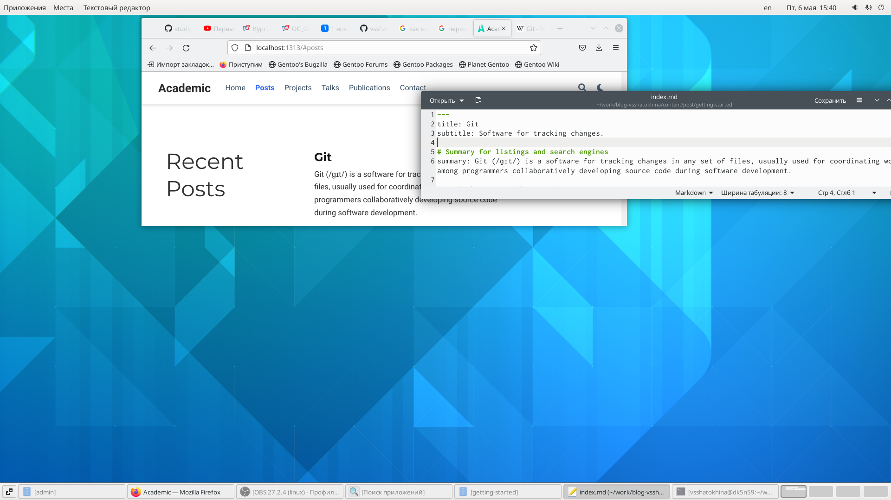
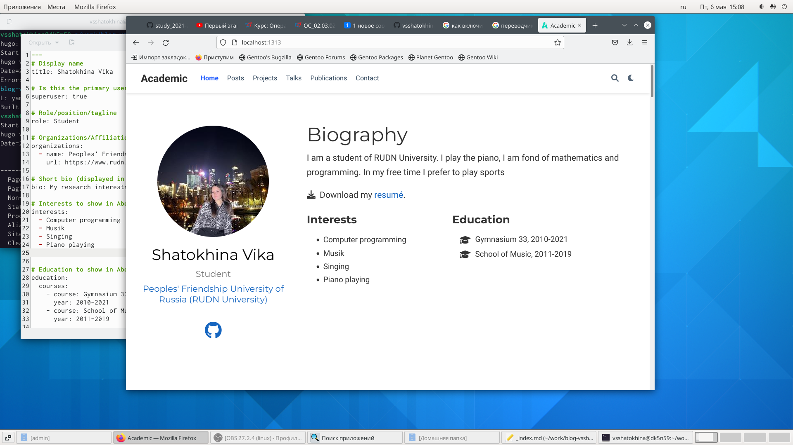

---
# Front matter
lang: ru-RU
title: "Индивидуальный проект. Этап 2"
subtitle: "Редактирование информации о себе. И создание поста."
author: "Шатохина Виктория Сергеевна"

# Formatting
toc-title: "Содержание"
toc: true # Table of contents
toc_depth: 2
fontsize: 12pt
linestretch: 1.5
papersize: a4paper
documentclass: scrreprt
polyglossia-lang: russian
polyglossia-otherlangs: english
mainfont: PT Serif
romanfont: PT Serif
sansfont: PT Sans
monofont: PT Mono
mainfontoptions: Ligatures=TeX
romanfontoptions: Ligatures=TeX
sansfontoptions: Ligatures=TeX,Scale=MatchLowercase
monofontoptions: Scale=MatchLowercase
indent: true
pdf-engine: lualatex
header-includes:
  - \linepenalty=10 # the penalty added to the badness of each line within a paragraph (no associated penalty node) Increasing the value makes tex try to have fewer lines in the paragraph.
  - \interlinepenalty=0 # value of the penalty (node) added after each line of a paragraph.
  - \hyphenpenalty=50 # the penalty for line breaking at an automatically inserted hyphen
  - \exhyphenpenalty=50 # the penalty for line breaking at an explicit hyphen
  - \binoppenalty=700 # the penalty for breaking a line at a binary operator
  - \relpenalty=500 # the penalty for breaking a line at a relation
  - \clubpenalty=150 # extra penalty for breaking after first line of a paragraph
  - \widowpenalty=150 # extra penalty for breaking before last line of a paragraph
  - \displaywidowpenalty=50 # extra penalty for breaking before last line before a display math
  - \brokenpenalty=100 # extra penalty for page breaking after a hyphenated line
  - \predisplaypenalty=10000 # penalty for breaking before a display
  - \postdisplaypenalty=0 # penalty for breaking after a display
  - \floatingpenalty = 20000 # penalty for splitting an insertion (can only be split footnote in standard LaTeX)
  - \raggedbottom # or \flushbottom
  - \usepackage{float} # keep figures where there are in the text
  - \floatplacement{figure}{H} # keep figures where there are in the text
---

# Цель работы

Добавить к сайту данные о себе. Добавить пост на тему: "Управление версиями. Git."

# Задания 

Добавить к сайту данные о себе.
Список добавляемых данных.
Разместить фотографию владельца сайта.
Разместить краткое описание владельца сайта (Biography).
Добавить информацию об интересах (Interests).
Добавить информацию от образовании (Education).
Сделать пост по прошедшей неделе.
Добавить пост на тему по выбору:
Управление версиями. Git.
Непрерывная интеграция и непрерывное развертывание (CI/CD).

# Выполнение лабораторной работы

Для начала заходим в файл `content/authors/admin/_index.md` и пишем свои данные (рис. [-@fig:001]). https://github.com/vsshatokhina/study_2021-2022_os-intro/blob/master/project-personal/stage2/report/image/1.png

{ #fig:001 width=90% }

Далее в папку `content/authors/admin/` кладём свою фотографию и даём ей имя `avatar.jpg` (рис. [-@fig:002]) https://github.com/vsshatokhina/study_2021-2022_os-intro/blob/master/project-personal/stage2/report/image/2.png

{ #fig:002 width=90% }

2. Добавить пост. 

Я выбрала тему Git.
Для создания поста я зашла в файл `content/post/getting-started/index.md` и изменила в нем контент для нашего поста.(рис. [-@fig:003]) https://github.com/vsshatokhina/study_2021-2022_os-intro/blob/master/project-personal/stage2/report/image/3.png

{ #fig:003 width=90% }

3. Сделать пост по прошедшей неделе.

Нам нужно обновить данные нашего сайта на github pages, чтобы все что мы сделали было не только на localhost.

Для этого воспользуемся командой `hugo` для сборки сайта, в папке `./public` появятся новые static файлы. Их необходимо будет отправить на гитхаб в репозиторий `<username>.github.io` командой `git push origin main`, предварительно добавив новые файлы (`git add .`) и создав новый коммит (`git commit -am "stage02"`).

В результате получим обновленную страничку (рис. [-@fig:004]) https://github.com/vsshatokhina/study_2021-2022_os-intro/blob/master/project-personal/stage2/report/image/4.png

{ #fig:004 width=90% }

# Вывод

Добавили к сайту данные о себе. Добавили пост на тему: "Управление версиями. Git."

# Список литературы{.unnumbered}

::: {#refs}
:::
