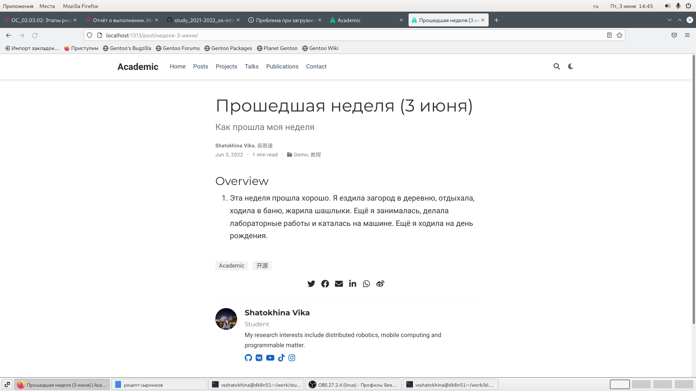

---
## Front matter
title: "Отчёт по Индивидуальному проекту этап 6"
subtitle: "Операционные системы"
author: "Шатохина Виктория Сергеевна "

## Generic otions
lang: ru-RU
toc-title: "Содержание"

## Bibliography
bibliography: bib/cite.bib
csl: pandoc/csl/gost-r-7-0-5-2008-numeric.csl

## Pdf output format
toc: true # Table of contents
toc-depth: 2
lof: true # List of figures
lot: true # List of tables
fontsize: 12pt
linestretch: 1.5
papersize: a4
documentclass: scrreprt
## I18n polyglossia
polyglossia-lang:
  name: russian
  options:
	- spelling=modern
	- babelshorthands=true
polyglossia-otherlangs:
  name: english
## I18n babel
babel-lang: russian
babel-otherlangs: english
## Fonts
mainfont: PT Serif
romanfont: PT Serif
sansfont: PT Sans
monofont: PT Mono
mainfontoptions: Ligatures=TeX
romanfontoptions: Ligatures=TeX
sansfontoptions: Ligatures=TeX,Scale=MatchLowercase
monofontoptions: Scale=MatchLowercase,Scale=0.9
## Biblatex
biblatex: true
biblio-style: "gost-numeric"
biblatexoptions:
  - parentracker=true
  - backend=biber
  - hyperref=auto
  - language=auto
  - autolang=other*
  - citestyle=gost-numeric
## Pandoc-crossref LaTeX customization
figureTitle: "Рис."
tableTitle: "Таблица"
listingTitle: "Листинг"
lofTitle: "Список иллюстраций"
lotTitle: "Список таблиц"
lolTitle: "Листинги"
## Misc options
indent: true
header-includes:
  - \usepackage{indentfirst}
  - \usepackage{float} # keep figures where there are in the text
  - \floatplacement{figure}{H} # keep figures where there are in the text
---

# Цель работы

Размещение двуязычного сайта на Github

# Задание

    Сделать поддержку английского и русского языков.
    Разместить элементы сайта на обоих языках.
    Разместить контент на обоих языках.
    Сделать пост по прошедшей неделе.
    Добавить пост на тему по выбору (на двух языках).

   
# Выполнение

Сделали поддержку английского и русского языков. (рис. [-@fig:001]) https://github.com/vsshatokhina/study_2021-2022_os-intro/blob/master/project-personal/stage6/report/image/1.png

{ #fig:001 width=70% }

Разместить элементы сайта на обоих языках. (рис. [-@fig:002]) https://github.com/vsshatokhina/study_2021-2022_os-intro/blob/master/project-personal/stage6/report/image/2.png

{ #fig:002 width=70% }

Сделала пост по прошлой неделе. (рис. [-@fig:003]) https://github.com/vsshatokhina/study_2021-2022_os-intro/blob/master/project-personal/stage6/report/image/3.png

{ #fig:003 width=70% }

Добавила пост на тему по выбору. (рис. [-@fig:004]) https://github.com/vsshatokhina/study_2021-2022_os-intro/blob/master/project-personal/stage6/report/image/4.png

{ #fig:004 width=70% }

# Выводы

Разместили двуязычный сайт на Github

# Список литературы{.unnumbered}

::: {#refs}
:::
